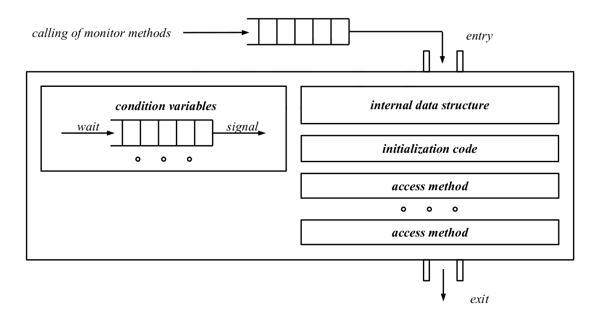

# Monitores
Mecanismo de sincronização de alto nível para resolver os problemas de sincronização entre processos, numa perspetiva __top-down__. Propostos independentemente por Hoare e Brinch Hansen

Seguindo esta filosofia, a **exclusão mútua** e **sincronização** são tratadas **separadamente**, devendo os processos:

1. Entrar na sua zona crítica
2. Bloquear caso não possuam condições para continuar


Os monitores são uma solução que suporta nativamente a exclusão mútua, onde uma aplicação é vista como um conjunto de _threads_ que competem para terem acesso a uma estrutura de dados partilhada, sendo que esta estrutura só pode ser acedida pelos métodos do monitor.

Um monitor assume que todos os seus métodos **têm de ser executados em exclusão mútua**:

- Se uma _thread_ chama um **método de acesso** enquanto outra _thread_ está a executar outro método de acesso, a sua **execução é bloqueada** até a outra terminar a execução do método

A sincronização entre threads é obtida usando **variáveis condicionais**:

- `wait`: A _thread_ é bloqueada e colocada fora do monitor
- `signal`: Se existirem outras _threads_ bloqueadas, uma é escolhida para ser "acordada"


## Implementação
```cpp
	monitor example
	{
	/* internal shared data structure */
	DATA data;
	
	condition c; /* condition variable */
	
	/* access methods */
	method_1 (...)
	{
		...
	}
	method_2 (...)
	{
		...
	}
	
	...

	/* initialization code */
	...
```

## Tipos de Monitores

### Hoare Monitor


- Monitor de aplicação geral
- Precisa de uma stack para os processos que efetuaram um `wait` e são colocados em espera
- Dentro do monitor só se encontra a _thread_ a ser executada por ele
- Quando existe um `signal`, uma _thread_ é **acordada** e posta em execução


### Brinch Hansen Monitor


- A última instrução dos métodos do monitor é `signal`
	- Após o `signal` a  _thread_ sai do monitor
- **Fácil de implementar:** não requer nenhuma estrutura externa ao monitor
- **Restritiva:** **Obriga** a que cada método só possa possuir uma instrução de `signal`


### Lampson/Redell Monitors


- A _thread_ que faz o `signal` é a que continua a sua execução (entrando no monitor)
- A _thread_ que é acordada devido ao `signal` fica fora do monitor, **competindo pelo acesso** ao monitor
- Pode causar **starvation**.
	- Não existem garantias que a __thread__ que foi acordada e fica em competição por acesso vá ter acesso
	- Pode ser **acordada** e voltar a **bloquear**
	- Enquanto está em `ready` nada garante que outra _thread_ não dê um `signal` e passe para o estado `ready`
	- A _thread_ que tinha sido acordada volta a ser **bloqueada**


## Bounded-Buffer Problem usando Monitores
```c
shared FIFO fifo;			 /* fixed-size FIFO memory */
shared mutex access;		 /* mutex to control mutual exclusion */
shared cond nslots;		 /* condition variable to control availability of slots*/
shared cond nitems;		 /* condition variable to control availability of items */

/* producers - p = 0, 1, ..., N-1 */
void producer(unsigned int p)
{
	DATA data;
	forever
	{
		produce_data(&data);
		lock(access);
		if/while (fifo.isFull())
		{
			wait(nslots, access);
		}
		fifo.insert(data);
		unlock(access);
		signal(nitems);
		do_something_else();
	}
}

/* consumers - c = 0, 1, ..., M-1 */
void consumer(unsigned int c)
{
	DATA data;
	forever
	{
		lock(access);
		if/while (fifo.isEmpty())
		{
			wait(nitems, access);
		}
		fifo.retrieve(&data);
		unlock(access);
		signal(nslots);
		consume_data(data);
		do_something_else();
	}
}
```

O uso de `if/while` deve-se às diferentes implementações de monitores:

- `if`: **Brinch Hansen** 
	- quando a _thread_ efetua o `signal` sai imediatamente do monitor, podendo entrar logo outra _thread_
- `while`: **Lamson Redell**
	- A _thread_ acordada fica à espera que a _thread_ que deu o `signal` termine para que possa **disputar** o acesso
	

- O `wait` internamente vai **largar a exclusão mútua**
	- Se não larga a exclusão mútua, mais nenhum processo consegue entrar
	- Um wait na verdade é um  `lock(..)` seguido de `unlock(...)`
- Depois de efetuar uma **inserção**, é preciso efetuar um `signal` do nitems
- Depois de efetuar um **retrieval** é preciso fazer um `signal` do nslots
	- Em comparação, num semáforo quando faço o up é sempre incrementado o seu valor
- Quando uma _thread_ emite um `signal` relativo a uma variável de transmissão, ela só **emite** quando alguém está à escuta
	- O `wait` só pode ser feito se a FIFO estiver cheia
	- O `signal` pode ser sempre feito
	
É necessário existir a `fifo.empty()` e a `fifo.full()` porque as variáveis de controlo não são semáforos binários.

O valor inicial do **mutex** é 0.


## POSIX support for monitors
A criação e sincronização de _threads_ usa o _Standard POSIX, IEEE 1003.1c_.

O _standard_ define uma API para a **criação** e **sincronização** de _threads_, implementada em Unix pela biblioteca _pthread_

O conceito de monitor **não existe**, mas a biblioteca permite ser usada para criar monitores _Lampsom/Redell_ em C/C++, usando:

- `mutexes`
- `variáveis de condição`

	
As funções disponíveis são:

- `ptread_create`: **cria** uma nova _thread_ (similar ao _fork_)
- `ptread_exit`: equivalente à `exit`
- `ptread_join`: equivalente à `waitpid`
- `ptread_self`: equivalente à `getpid`
- `pthread_mutex_*`: manipulação de **mutexes**
- `ptread_cond_*`: manipulação de **variáveis condicionais**
- `ptread_once`: inicialização

