# Introdução à Gestão de Memória


## Porquê a gestão de memória
- Para puder executar um programa este tem de residir em **memória principal**
	- As varáveis, instruções, etc. tem de estar na memória principal, pelo menos de forma parcial
- É necessário maximizar a ocupação do processador e minimizar o tempo de resposta (`turn-around time`)
	- Ambiente **multiprogramado** 
	- Ocorre **comutação de processos**
	- Existem **vários processos em memória**
		

> **Lei de Parkinson** _"Os programas tendem a expandir-se ocupando toda a memória disponível"_

Ou seja, apesar de o espaço disponível em memória principal ter aumentado ao longo dos anos, os mesmos problemas mantêm-se.

Supondo que a **fração de ocupação do processador** pode ser modelada de forma simplificada pela expressão 
$$\%_{ocupação CPU} = 1 - p^n$$
onde:

- `p`: fração de tempo em que um processo está **bloqueado à espera** que as operações de I/O, sincronização, etc terminem
- `n`: **número de processos** que **coexistem** de forma concorrente e a competir por recursos em memória principal

Supondo $p = 0.8$, temos:

| Nº de processos em Memória Principal | \% de ocupação do Processador |
|:------------------------------------:|:-----------------------------:|
| 4  | 59 |
| 8  | 83 |
| 12 | 93 |
| 16 | 97 |

De forma mais geral:


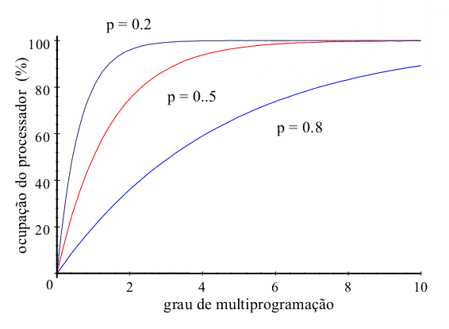

O número de processos que devem estar em memória têm de ser otimizados. O número de processos em memória depende do número de processos I/O intensivos (`I/O-bound`) ou CPU intensivos (`CPU-bound`)

## Hierarquia da memória
Para melhorar a eficiência do sistema e reduzir os custos, as memórias devem ser otimizadas para as funções que vão desempenhar:

\begin{table}[H]
\centering
\begin{tabular}{@{}lccc@{}}
				& Cache        & Principal & Secundária \\ \toprule
 tamanho    & \begin{tabular}[c]{@{}c@{}}pequena \\ (dezenas de KB \\ ou unidades de MB)\end{tabular} 
 				& \begin{tabular}[c]{@{}c@{}}tamanho médio\\ (centenas de MB \\ ou unidades de MB)\end{tabular} 
				& \begin{tabular}[c]{@{}c@{}}Grande \\ (dezenas, centenas \\ ou milhares de GB)\end{tabular} \\
 velocidade & muito rápida & rápida    & lenta  \\
 preço      & cara  		   & razoável  & barata \\
 volátil    &  ✓           & ✓         & x \\ 
\end{tabular}
\vspace{5mm}
\caption{Comparação entre os diferentes tipos de memórias de um sistema computacional}
\end{table}


### Memória Cache
- Contém uma cópia das **posições** e **operandos** mais frequentemente referenciadas pelo processador num passador próximo
- Existem 3 tipos de `memória cache`
	- **L1:** localizada no **IC[^1] do processador**
	- **L2** e **L3:** localizadas num **IC autónomo** mas no mesmo substrato que L1
- O controlo da transferência de dados de/para a memória principal é feito de modo quase completamente **transparente** ao programador
- É útil devido ao **princípio da localidade de referência**


[^1]: IC: Integrated Circuit

### Memória Secundária
Duas funções principais:

- Armazenar de forma **não volátil** a informação (dados e programas), através de um **sistema de ficheiros** implementado no dispositivo
- **extender a memória principal** para que o tamanho desta não seja limitativo ao número de processos que podem coexistir em memória - `área de wapping`


### Princípio da Localidade da Referência

Temporal:
> Quando é acedido um endereço de memória (quer seja para r/w uma variável ou para ler uma instrução), a probabilidade de voltar a aceder a esse mesmo endereço de memória é mais elevada do que aceder a outros endereços de memória

Espacial:
> Quando é acedido um endereço de memória (quer seja +ara r/w de uma variável ou para ler uma instrução), a probabilidade de aceder a offsets do endereço de memória é mais elevada do que aceder a endereços muito distantes

Estes princípios baseiam-se no facto de que quanto **mais afastada** uma instrução/operando está do endereço atual que o processador está a executar, **menos vezes será referenciado**. 

O uso destes princípios no design de software e hardware tem como objetivo diminuir o tempo médio de acesso à referência.

Estes princípios foram derivados da **constatação heurística** do comportamento de um programa em execução. Conclui-se que as referências à memória durante a sua execução tendem a **concentrar-se** em **frações bem definidas do seu espaço de endereçamento** em intervalos de tempo mais ou menos longos

## Gestão da memória num ambiente multiprogramado
- **objetivo:** Tirar partido dos princípios anteriores


A função principal é **controlar a transferência de dados** entre a **memória principal** e a **memória secundária**, garantindo:

- Manter o _track_  das partes da **memória principal** que estão **ocupadas** e as partes que estão **livres**
- Reservar secções da memória para as necessidades dos processos
- Libertar secções da memória quando os processos terminam
- Transferir para a `área de swapping` a totalidade/parte do **espaço de endereçamento** de um processo quando a memória principal não consegue guardar todos os processos que coexistem em memória


## Espaço de Endereçamento


- Os ficheiros `object` (resultantes da compilação), possuem todos os seus endereços das diversas instruções, constantes e variáveis calculados a partir do endereço 0 (início dos endereços do módulo)


Se a linkagem for **estática:**

- Após linkagem, os diferentes ficheiros objeto são reunidos num único ficheiro executável
	- São resolvidas as várias referências externas
	- As bibliotecas de sistema podem não estar incluídas na linkagem para minimizar o tamanho do ficheiro
- O `loader` constrói a **imagem binária do espaço de endereçamento do processo**
	- ficheiro executável + bibliotecas de sistema
	- Resolve todas as dependências externas que não foram incluídas no ficheiro executável no processo de linkagem


Se a linkagem for **dinâmica**, cada referência no código do processo é substituída por um `stub`:

- `stub`: pequeno conjunto de instruções que determina a localização de uma rotina
	- se a rotina estiver em memória principal, executa-a
	- se não estiver, força o seu carregamento para memória principal (e depois executa-a)
- Quando um `stub` é executado **pela primeira vez** obtém a referência para o endereço de memória da rotina
	- Substitui no **código do processo** o seu endereço pelo endereço da rotina
	- Executa a rotina
- Quando a secção de código onde era executado o `stub` é novamente atingida, a **rotina do sistema** é executada **diretamente**


Como vários processos independentes podem executar a mesma biblioteca do sistema, ao todos executarem uma cópia do código **minimiza-se** a ocupação da **memória principal**


- As zonas de de código e definição estática de variáveis têm um **tamanho fixo**
	- Determinado pelo `loader`
- As `zonas de definição dinâmica` e a `stack` podem variar de tamanho ao longo da execução do programa
	- O espaço de memória referente à `zona de definição dinâmica` e à `stack` pode ser usada alternativamente entre eles
	- Quando o espaço para a `stack` cresce e o espaço disponível é esgotado pelo **lado da `stack`**, ocorre um `stack overflow`

### Exemplo
 Considerando o seguinte código fonte

```c
//ficheiro fonte
#include <stdio.h>
#include <stdlib.h>

int main (void)
{
	printf ("hello, world!\n");
	exit (EXIT_SUCCESS);
}
```

A produção do ficheiro objeto pode ser feita com:

```bash
gcc -Wall -c hello.c
```

E o executável gerado através de:

```bash
gcc -o hello hello.o
```

Antes da linkagem temos:

```bash
>> file hello.o
hello.o: ELF 32-bit LSB relocatable, Intel 80386, version 1 (SYSV), not stripped
```

```bash
>> objdump -fstr hello.o

hello.o:      file format elf32-i386
architecture: i386, flags 0x00000011:
HAS_RELOC, HAS_SYMS
start address 0x00000000
SYMBOL TABLE:
00000000 l     df *ABS* 00000000 hello.c
00000000 l     d .text            00000000
00000000 l     d .data            00000000
00000000 l     d .bss             00000000
00000000 l     d .rodata          00000000
00000000 l     d .note.GNU-stack 00000000
00000000 l     d .comment         00000000
00000000 g      F .text 0000002a main
00000000          *UND* 00000000 printf
00000000          *UND* 00000000 exit

RELOCATION RECORDS FOR [.text]:
OFFSET   TYPE              VALUE
00000014 R_386_32          .rodata
00000019 R_386_PC32        printf
00000026 R_386_PC32        exit

Contents of section .rodata:
 0000 68656c6c 6f20776f 726c6421 0a000000   hello world!....

Contents of section .comment:
 0000 00474343 3a202847 4e552920 332e332e   .GCC: (GNU) 3.3.
 0010 3120284d 616e6472 616b6520 4c696e75   1 (Mandrake Linu
 0020 7820392e 3220332e 332e312d 326d646b   x 9.2 3.3.1-2mdk
 0030 2900                                  ).
$
```

Após a linkagem temos:

```bash
>> file hello
hello: ELF 32-bit LSB executable, Intel 80386, version 1 (SYSV), for GNU/Linux
2.2.5, dynamically linked (uses shared libs), not stripped
```

```bash
>> objdump -fTR hello

hello:     file format elf32-i386
architecture: i386, flags 0x00000112:
EXEC_P, HAS_SYMS, D_PAGED
start address 0x080482d0
DYNAMIC SYMBOL TABLE:
0804829c      DF *UND* 000000e6 GLIBC_2.0      __libc_start_main
080482ac      DF *UND* 0000002d GLIBC_2.0      printf
080482bc      DF *UND* 000000c8 GLIBC_2.0      exit
080484b4 g    DO .rodata         00000004 Base         _IO_stdin_used
00000000 w    D *UND* 00000000                 __gmon_start__
DYNAMIC RELOCATION RECORDS
OFFSET   TYPE              VALUE
080495cc R_386_GLOB_DAT    __gmon_start__
080495c0 R_386_JUMP_SLOT   __libc_start_main
080495c4 R_386_JUMP_SLOT   printf
080495c8 R_386_JUMP_SLOT   exit
$
```

Podemos verificar que passam a existir mais instruções no ficheiro `object`:

- A função `main` tem de ser executada por alguém...
- É preciso construir o `argv` e o `argc` para passar à `main`
- Implica código adicional 

### Espaço de endereçamento lógico vs físico
- **espaço de endereçamento lógico:** espaço de endereçamento realocável
- **espaço de endereçamento físico:** região da memória principal onde o processo é carregado para ser executado


Uma vez que a **Imagem binária do espaço de endereçamento de um processo** é mapeada no **espaço lógico** do processo, em sistemas multiprogramados é necessário garantir:

- **mapeamento dinâmico:** capacidade de conversão em `run-time` de um **endereço lógico** num **endereço físico**
	- Passo intermédio para permitir o armazenamento do espaço de endereçamento de um processo em qualquer região da memória principal (incluindo a sua mudança em `run-time`)
- **proteção dinâmica:** impedimento em `run-time` de referenciar endereços que estão localizados fora do espaço de endereçamento do processo (aka, `core dumped`)


# Arquitecturas de Memória Particionadas

## Arquitectura de partições fixas
- A memória principal (restante) é dividida num **conjunto fixo de partições**
	- Mutualmente exclusivas
	- Não necessariamente iguais
- Cada uma das partições contém o espaço de endereçamento físico de um processo


- A memória principal vai sendo dividida à medida que vai recebendo solicitações
- Podem ser utilizadas diferentes filosofias de escalonamento
	- **Valorização do critério de justiça**
		- Escolher o primeiro processo da fila de espera dos processos `Suspended-Ready` cujo **espaço de endereçamento cabe na partição**
	- **Valorização da ocupação da memória principal**
		- Escolher o primeiro processo da fila de espera dos processos `Suspended-Ready` com o **espaço de endereçamento de tamanho maior** que caiba na partição
		- Corre-se o risco de adiamento indefinido de processos com espaço de endereçamento pequeno (`starvation`)
		- Por isso associa-se um contador a cada processo
			- o contador é incrementado a cada passagem
			- contador > valor pré-definido $\implies$ **processo já não pode ser descartado**
			- Passa-se a aplicar a 1ª  regra


### Vantagens e Desvantagens
**Vantagens:**

- `simples de implementar`: não exige hardware ou estruturas de dados especiais para gerir a memória
- `eficiente`: a seleção pode ser feita rapidamente com qualquer das políticas acima


**Desvantagens:**

- `fragmentação interna da memória principal`: o espaço restante de cada partição que não é alocado pelo processo é desperdiçado
- `política direcionada para certos tipos de aplicações`: 
	- O tamanho das partições é fixo
	- A única maneira de ser evita o desperdício de memória é através da adequação do tamanho das partições ao tipo de processos a utilizar
		- número de processos
		- tipo de processos
		- tamanho do seu espaço de endereçamento
	- torna a solução pouco generalizável


## Arquitectura de posições variáveis


- Toda a parte disponível da memória constitui um bloco único
	- Sucessivamente são alocadas alocadas/atribuídas/reservadas regiões de tamanho suficiente para conter o espaço de endereçamento dos processos que vão sendo criados/`swapped-in`
	- Posteriormente ao processo terminar, os espaços de endereçamento deixam de ser usados e são libertados


### Gestão do espaço
Como a memória é reservada dinamicamente, o sistema de operação tem de manter um registo atualizado de:

- **Regiões livres:**
	- regiões ainda disponíveis na memória para armazenar o espaço de endereçamento dos novos processos:
		- criados
		- transferidos da `área de swapping`
- **Regiões Ocupadas:**
	- localiza as regiões que foram reservadas para armazenamento do espaço	de endereçamento dos processos que residem em memória principal


Usando uma lista biligada (ou simplesmente ligada) para cada região. Estas listas:

- Não vão sempre indicar os espaços livres 
- Podem ser alargadas
- A sua gestão em feita em blocos
	- Posso adicionar blocos à lista medida que vou libertando blocos da memória principal
	- Se o bloco a libertar estiver contíguo a um (ou dois) bloco(s) livre(s) tenho de modificar a lista (e não simplesmente introduzir um novo bloco)


**Problema:** Se a região de memória reservada for exatamente a suficiente para o espaço de armazenamento do processo, existe o risco de `fragmentar` o disco em regiões de memória tão pequenas que não podem ser utilizadas. Para complicar, estas partições seriam introduzidas na lista de regiões livres tornando a lista mais complexa e aumentando o seu custo de processamento

**Solução:** A memória principal é dividida em múltiplos de **blocos de tamanho fixo** que constituem a unidade de trabalho para a alocação de partições

### Exemplo
Considerando o seguinte diagrama e tabela que mostra a distribuição de 3 processos em memória, juntamente com o espaço ocupado pelo sistema operativo e, temos:


|		                     | Tamanho (bytes) |
|:------------------------:|:---------------:|
| Memória Principal        | 256 M				|
| Sistema de Operação      | 4M					|
| Unidade de reserva [^3]  | 4K					|
| Processo A               | 4M					|
| Processo C               | 3M					|
| Processo D               | 1M 				   |

: Distribuição da ocupação da memória 

Tamanho mínimo de uma partição. Todos os endereços em memória são múltiplos da unidade de reserva


A obtenção da `lista das regiões ocupadas` e da `lista das regiões livres` pode ser determinada de forma trivial:


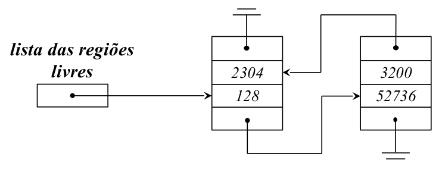


### Políticas de Escalonamento
 
A **valorização do critério de justiça** é a disciplina de escalonamento mais adotada.

- É escolhido o **primeiro** processo da **fila de espera** dos processos `Suspended-Ready` cujo espaço de endereçamento pode ser colocado em memória principal
- O **principal problema** de uma arquitectura de partições variáveis é o `grau de fragmentação externa` que é produzido na memória principal
	- sucessivas **alocações** e **libertações** das partições do espaço de endereçamento dos processos
	- em casos críticos, podemos ter situações em que apesar de **haver memória livre em quantidade suficiente**, ela **não é continua** e não é possível alocar espaço em memória para um novo processo
- A solução passa por efetuar `garbage collection`
	- agrupar todas as posições/partições de memória livres num dos extremos da memória
	- obriga a mudança em memória de todos os processos realocados
	- exige a paragem de todo o processamento
	- se a memória for grande, tem um tempo de execução elevado


Para a escolha da região de memória principal a ser reservada para o armazenamento do processo, dominam as seguintes políticas:
1.`first fit`
	- A lista de regiões livres é pesquisada desde o princípio
	- A região de memória a ocupar é a primeira região com tamanho suficiente encontrada
2. `next fit`
	- Variante do `first fit`, com os mesmos princípios de decisão 
	- No entanto, a pesquisa é iniciada do ponto de paragem da pesquisa anterior
3. `best fit`
	- A lista de regiões livres é pesquisada na sua totalidade
	- Escolhe-se a região mais pequena de tamanho igual ou maior ao espaço de endereçamento do processo
4. `worst fit`
	- A lista de regiões livres é pesquisada na sua totalidade
	- A região escolhida é a maior região existente


Algumas considerações:

- Uma política que seja boa/rápida a inserir elementos na fila será má/lenta a removê-la
- É difícil encontrar soluções que sejam tão rápidas a inserir como a remover da fila de partições
- Os diferentes métodos possuem diferentes desempenhos:
	- grau e tipo de fragmentação causado
	- eficiência na reserva/libertação do espaço


### Vantagens vs Desvantagens

**Vantagens:**

- `Geral`: O âmbito da sua aplicação é independente do:
	- tipo de processos que vão ser executados
	- número
	- e tamanho do seu espaço de endereçamento (com algumas limitações)
- `pouco complexo`
	- não exige `hardware` especial
	- as estruturas reduzem-se a listas biligadas


**Desvantagens:**

- `Grande fragmentação externa da memória principal`
	- Uma fração da memória principal acaba por ser desperdiçada
	- É dividida em regiões reduzidas que não são úteis
	- O desperdício de memória pode chegar a um terço (regra dos 50%)
- `Pouco Eficiente`
	- Não é possível desenvolver algoritmos que sejam eficientes quer a:
		- **reservar/alocar espaço** 
		- **libertar espaço**


# Organização da memória real

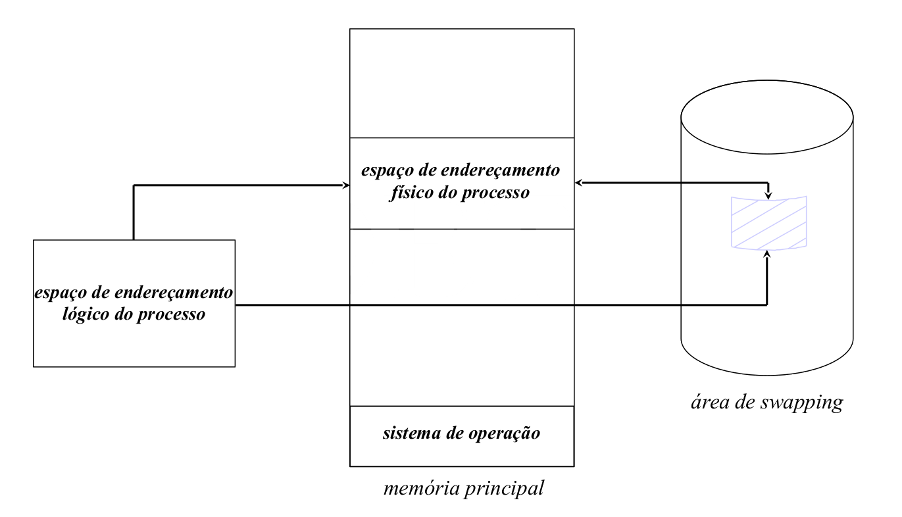

Existe uma correspondência biunívoca [^2] entre o **espaço de endereçamento lógico** de um processo e o **espaço de endereçamento físico** de um processo. Isto implica

- O **espaço de endereçamento de um processo é limitado**
	- O espaço de endereçamento de um processo nunca pode ser superior ao tamanho de memória principal disponível
	- Os mecanismos que o tentem fazer devem ser bloqueados
- O **espaço de endereçamento físico de um processo deve ser contíguo**
	- Não e uma condição estritamente necessária
	- Simplifica e torna mais eficiente se o espaço de endereçamento de um processo for obrigado a ser contíguo
- A **existência de uma área de swapping**
	- Serve como extensão da memória principal
	- Armazena espaços de endereçamentos de processos que não podem residir em memória principal por falta de espaço

[^2]: De um para um

## Tradução de um endereço lógico num endereço físico

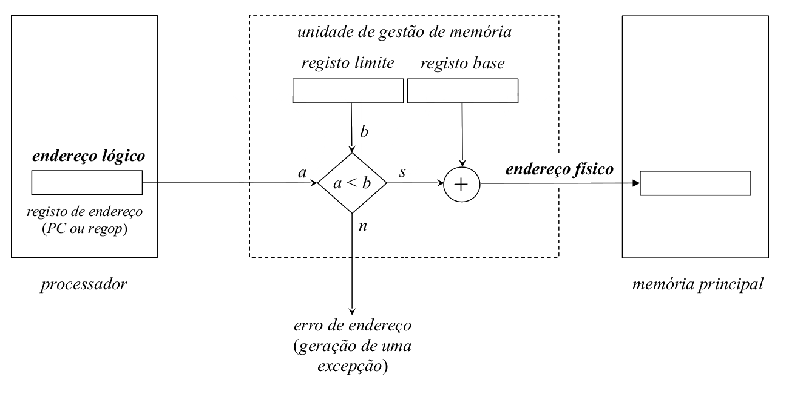

- `registo base`: endereço do início da região de memória principal onde está alojado o espaço de endereçamento físico do processo
- `registo limite`: tamanho em _bytes_ do espaço de endereçamento


Na comutação de processos:

- `dispatch` carrega o registo base e o registo limite da tabela de controlo de processos do processo que vai ser calendarizado para discussão


Sempre que há uma referência à memória, o **endereço lógico** comparado com o **registo limite** e:

- Se for **maior** $\implies$ **referência inválida**
	- Acesso à memória nulo é executado (aka `dummy cycle`)
	- É gerada uma exceção por erro de endereço
- Se for **menor** $\implies$ **referência válida**
	- a referência aponta para dentro do espaço de endereçamento do processo
	- o conteúdo do registo base é adicionado ao endereço lógico para produzir o endereço físico


## Memória real e o ciclo de vida de um processo

Depois de carregado o Sistema Operativo, o que resta da memória principal é usado para conter o espaço de endereçamento dos diferentes processos

### Criação de um processo

- O processo está no estado `CREADTED`
- São inicializadas as estruturas de dados destinadas a geri-lo
	- A imagem binária do seu espaço de endereçamento é construída
	- O valor do campo `registo limite` da entrada da tabela de controlo de processos é determinado
- Se houver espaço em memória
	- o espaço de endereçamento do processo é carregado
	- o campo `registo base` é atualizado com o endereço inicial da região reservada
	- o processo transita para o estado `Ready-to-Run` e é colocado na respetiva fila de espera
- Se não houver espaço em memória
	- O processo transita para o estado `Suspended-Ready`
	- O processo é colocado na respetiva fila de espera
	- O seu espaço de endereçamento é armazenado temporariamente na `área de swap` 


### Ciclo de Vida do processo
- Ao longo da sua execução, o espaço de endereçamento do processo pode ser deslocado temporariamente para a `área de wapping`.
	- `Ready-to-Run` $->$ `Suspended-Ready`
	- `Blocked` $->$ `Suspended-Blocked`
- Sempre que há espaço em memória
	- Um dos processos presentes na fila de espera dos processos `Suspended-Ready` é selecionado
	- O seu espaço de endereçamento é carregado
	- O campo `registo base` da entrada da **tabela de controlo de processos** é atualizada com o endereço inicial da região reservada
	- O processo é colocado na fila de espera `Ready-to-Run`, transitando para esse estado
- Caso a lista de espera `Suspended-Ready` estiver vazia e existirem processos na fila de espera dos processos `Suspended-block`, um desses processos pode ser selecionado
	- À semelhança da transição `Suspended-Ready` para `Ready`, na transição `Suspended-Blocked` para `Blocked` as mesmas inicializações são feitas
	

### Fim de Vida do processo
- O processo transita para o estado `Terminated`
- O seu espaço de endereçamento é transmitido para a `área de swapping` (se não estiver lá), para aguardar o fim das operações


# Organização da memória virtual
- Num sistema com memória virtual, o `espaço de endereçamento lógico` e o `espaço de endereçamento físico` de um processo estão **totalmente dissociados**


Como consequência:

- `O espaço de endereçamento de um processo não está limitado à memória física`
	- O espaço de endereçamento virtual é "ilimitado"
	- Podem criar-se mecanismos que permitam a um processo ocupar mais do que a memória principal disponível
- `Não continuidade do espaço de endereçamento físico`
	- O espaço de endereçamento dos processos podem estar dispersos por toda a memória
		- quer os blocos sejam de tamanho fixo ou variável
	- Garante-se uma ocupação mais eficiente do espaço disponível
- `Área de swapping`
	- Serve como extensão da memória principal
	- Guarda uma imagem atualizada dos espaços de endereçamento dos processos que coexistem de forma concorrente
	- guarda também as variáveis dinamicamente alocadas:
		- stack
		- zona de definição estática


## Tradução de um endereço lógico num endereço físico

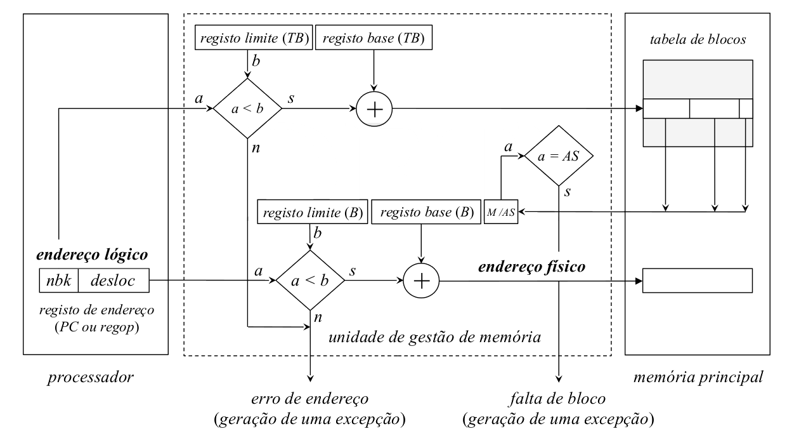

O endereço lógico é formado por dois campos:

- **nbk:** identificador de um bloco específico
- **desloc:** localiza uma posição de memória concreta dento do bloco, através do cálculo da distância ao seu erro


A **unidade de gestão de memória** contém dois pares de `registos base` e `limite`

1. Associado com a **tabela de blocos do processo**:
	- descreve a localização dos vários blocos me que o espaço de endereçamento do processo está dividido
2. Descrição de um bloco particular

Quando ocorre uma **comutação de processos** a operação de `dispatch` carrega o `registo base` e o `registo limite` da tabela de blocos com os valores na tabela de controlo de processos (associada com o processo que vai ser calendarizado para execução)

	- O valor do `registo base da tabela de blocos` representa o **endereço do início da região de memória principal** onde está alojada a tabela de blocos do processo
	- O valor do `registo limite` está relacionado com o número de entradas na tabela

### Acesso à memória
- Decomposto em 3 fases


1. Campo `ndk` do `endereço lógico` é comparado com o valor do **registo limite da tabela de blocos**
	- $ nbk < registo limite (TB) $
		- nbk é adicionado ao conteúdo do `regiso base da tabela de blocos` para produzir o endereço da entrada da tabela de blocos
	- $ ndk >= registo limite (TB) $
		- A referência é inválida e não é efetuado nenhuma acesso à memória
		- A instrução é interrompida por uma instrução de acesso à memória nulo _(dummy cycle)_
		- Gera-se uma exceção por erro de endereço: _`segmentation fault`_
2. É efetuada a avaliação do registo `M/AS`(_Memória/Área de Swap_)
	- se `M`: os **campos** da entrada da **tabela de blocos** referenciada são transferidos para os **registos respetivos** da unidade de gestão de memória.
	- se `AS`: 
		- o bloco não está **atualmente em memória**
			- tem de ser transferido para a instrução puder continuar
		- Instrução finalizada com um acesso à memória nulo
		- Gera-se uma exceção por falta de bloco
			- será responsável por iniciar a transferência dos blocos da swap para a memória principal
		- Processo transita para o estado `blocked`
3. o campo `desloc` (deslocamento) do `endereço lógico` é comparado com o valor do `registo limite (B)` (do bloco)
	- $ desloc < registo\ limite\ (B) \implies$ **referência válida
		- A referência é efetuada para dentro do espaço de endereçamento do bloco
		- `desloc` é adicionado ao conteúdo do registo base do bloco para produzir o endereço físico
	- $ desloc >= registo\ limite\ (B) \implies$ **referência inválida**
		- é efetuado um acesso à memória nulo _(dummy cycle)_
		- gera-se uma exceção por erro de endereço _`segmentation fault`_

A gestão do espaço de memória principal usando uma organização de memória virtual possui a vantagem de permitir maior versatilidade, mas também possui o custo associado de que **cada pedido de acesso à memória (r/w) requer dois acessos para puder ser executado**

- **1ª Acesso:**
	- Referencia a entrada da tabela de blocos do processo, usando o campo `nbk` do endereço lógico como endereço do bloco em memória que contém o endereço da posição de memória que se quer ler/escrever
- **2º Acesso:** É feita referência à posição de memória específica (que se deseja efetivamente aceder)
	- O cálculo do seu endereço é efetuado adicionando o campo `desloc` do endereço lógico ao endereço que corresponde ao início do bloco em memória


- A organização em memória virtual causa um **fracionamento do espaço de endereçamento lógico** do processo.
- Os blocos/frações são tratadas dinamicamente como sub espaços de endereçamento **autónomos** numa organização de memória real
	- A memória real pode estar organizada em partições físicas ou em partições variáveis
- A diferença entre uma organização de memória virtual vs uma organização de memória real é que passas a existir a possibilidade de ocorrer o acesso a um bloco que atualmente não reside em memória principal
	- Nestas condições o sistema é capaz de anular a instrução de acesso atual
	- Meter em marcha a sequência de instruções que permite carregar esse bloco para memória principal
	- repetir a instrução assim que o bloco for carregado
	 

Evidentemente, a necessidade do duplo acesso à memória pode ser minimizada tirando partido do **Princípio da localidade da referência:**

- Os acessos tenderão a estar concentrados num conjunto bem definido de blocos durante grandes intervalos de tempo de execução do processo
- A MMU faz caching do conteúdo das entradas da tabela de blocos que forma ultimamente referenciadas, usando uma memória associativa _(`translation lookaside buffer (TLB)`)_:
	- Cada acesso passa assim a ser um:
		- `hit`: 
			- a entrada está armazenada no processador
			- o acesso é interno
			- não é referenciada memória na 1ª fase
		- `miss`:
			- a entrada não está armazenada na TLB
			- é preciso um acesso externo à memória principal na 1ª fase 
- O tempo médio de acesso a uma instrução/operado tende para:
	- Acesso ao TLB + acesso à memória principal


## Ciclo de vida de um processo
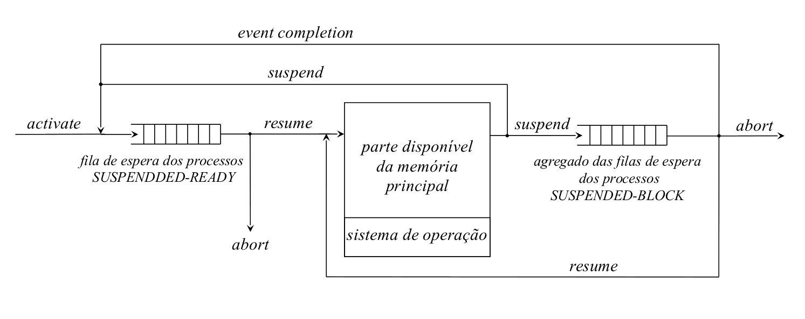

### Criação de um processo

- estado: `CREATED`
- são inicializadas a estruturas de dados destinadas a geri-lo
	- É construída a imagem binária do seu espaço de endereçamento
	- É transferida para a área de swapping a sua parte variável
	- A tabela de blocos associada é organizada 
		- Se existir espaço livre em memória é carregado em memória principal:
			- o 1º bloco de código do processo
			- o bloco da stack
			- as entradas correspondentes da tabela de blocos são atualizadas
			- estado: `READY-TO-RUN`
			- colocado na fila de espera de processos prontos a serem executados
		- Se não existir:
			- estado: `SUSPENDED-READY`
			- colocado na fila de espera de processos suspensos mas prontos a serem transferidos para memória principal e executados
- Os escalonadores tentam sempre garantir que o registo PC, a stack estão em memória e o primeiro bloco de instruções de estão em memória
		- São as condições principais para que um programa possa ser executado


### Ao longo da execução
- Se ocorrer um acesso a um bloco não residente em memória principal:
	- estado passa a `BLOCKED`
		- permanece `BLOCKED` enquanto ocorre a transferência do bloco para memória principal
		- quando a transferência terminar, passa a `READY-TO-RUN`
		- é colocado na fila de espera de processos `READY-TO-RUN`
- Os blocos residentes na memória principal pertencentes a um mesmo processo podem ser `swappeed-in`
	- os seus blocos são "movidos" para a área de swap
	- o estado passa de:
		- `READY-TO-RUN` -> `SUSPENDED-READY`
		- `BLOCKED` -> `SUSPENDED-BLOCK`
- Sempre que há espaço memória:
	- um dos processo presentes na fila de espera `SUSPENDED-READY` é selecionado
	- A tabela de blocos e um grupo de blocos do seu espaço de endereçamento são carregados
	- As entradas correspondentes na tabela são atualizadas com os endereços iniciais das regiões reservadas
	- o processo é colocado na fila de espera de processos `READY-TO-RUN`
- Se a lista `SUSPENDED-READY` estiver vazia e **houver processos na fila de espera** dos processos `SUSPENDED-BLOCK`
	- Pode ser selecionado um destes processos
	- Passa para o estado `BLOCKED` e é inserido na respetiva lista de espera


### Término de um processo
- estado: `TERMINATED`
- A imagem do seu espaço de endereçamento residente na área de swapping (ou pelo menos a sua parte variável) é atualizada
	- libertação de todos os blocos existentes em memória principal
	- Aguarda pelo fim das operações


## Exceção por falta de bloco
- A rotina de serviço a esta interrupção/exceção é responsável por em marcha as ações que permitam:
	- a transferência desse bloco da área de swapping para a memória principal
	- a repetição da instrução que produziu a referência

- Estas operações são realizadas de forma totalmente transparente ao utilizador

Se um processo estivesse continuamente a gerar exceções por falta de bloco:

- o ritmo de processamento seria muito lento
- o _`throughput`_ do sistema computacional seria mais baixo


Isto não acontece (pelo menos com tanta frequência devido à hierarquia da memória e principalmente há `Translation Lookaside Bffer` da unidade de memória, usando o princípio da localidade de referência.

Apesar da fração do espaço de endereçamento variar com o tempo, o custo em carregar vários  blocos pontualmente para memória, relativamente a outras soluções é reduzido, podendo progredir a execução do processo praticamente sem ocorrerem faltas de bloco.

Situações de falta de página degridem muito a qualidade do sistema

### Sequência de instruções
1. Salvaguardar o contexto do processo na entrada correspondente na tabela de controlo de processos
	- estado: `BLOCKED`
	- atualizar o seu \$PC [^1] para o endereço que produziu a falta de bloco
2. Determinar se existe espaço em memória para carregar o bloco em falta
	- Caso **exista**: selecionar uma região livre
	- Caso **não exista**: selecionar uma região cujo bloco vai ser substituído
		- se tiver sido modificado -> transferi-lo para a `área de swapping`
		- atualizar a entrada da tabela de blocos do processo a que o bloco pertence
			- indicar que o bloco já não se encontra em memória (registo `M/AS`)
3. Transferir o bloco em falta da área de swapping para a região selecionada
4. Invocar o escalonador para calendarizar a execução de um dos processos da fila de espera `READY-TO-RUN`
5. Quando a transferência estiver concluída
	- Atualizar a entrada da tabela de blocos do processo
		- indicar que o processo está residente em memória
		- indicar a sua localização
	- estado: `READY-TO-RUN`
	- colocar o processo na fila de espera `READY-TO-RUN`

[^1]: \$PC: registo do Program Counter
# Arquitectura paginada

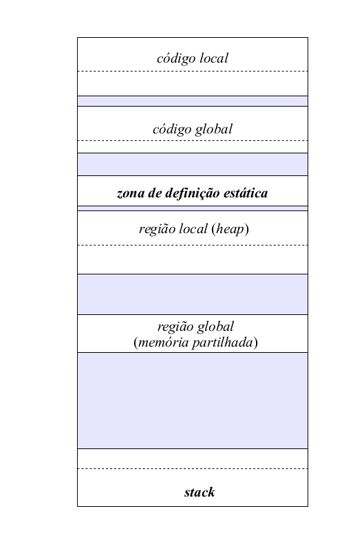

Os blocos do espaço de endereçamento do processo passam a ser designados de **páginas**.

- São todos iguais
- Tamanho múltiplo de uma potência de 2
	- Tipicamente 4 ou 8 KB
- 

O espaço de endereçamento lógico é endereçado usando:

- **bits mais significativos:** número da página
- **bits menos significativos:** deslocamento

A memória principal é dividida em blocos da **mesma dimensão** que as **páginas**. A estes blocos chamamos **frames**

O `linker` organiza o espaço de endereçamento lógico do processo atribuindo o início de uma nova página a cada uma das regiões funcionalmente distintas:

- código local
- código global
- zona de definição estática
- região local _(heap)_
- região global _(shared memory)_
- `stack` (neste caso, atribuí o fim da página)


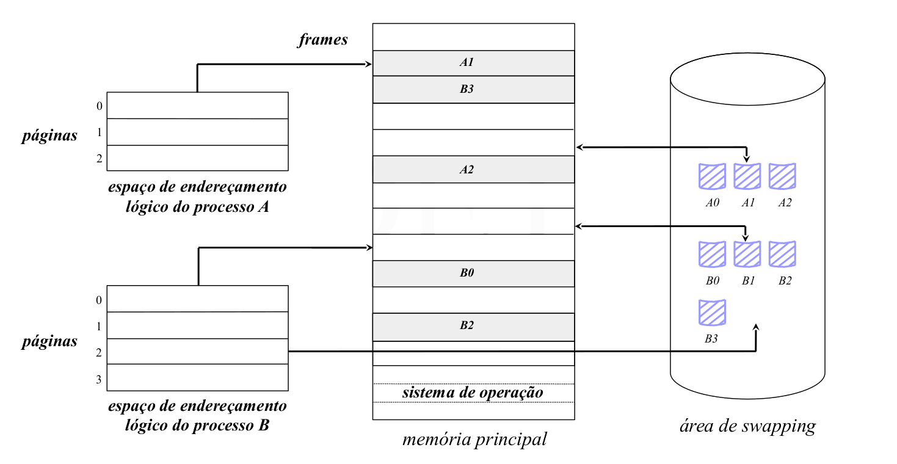

## Acesso à memória


- Deixa de ser necessário o registo limite na tabela de paginação do processo
	- A Tabela de paginação do processo só precisa do registo base
	- Não é necessário o endereço limite de uma página articular 
	- O endereço físico é formado pela concatenação entre os campos:
		- `nfrm` (identifica o frame da memória principal onde a página está localizada) 
		- `desloc` (identifica o deslocamento dentro da página/frame
		- endereço físico = nfrm | desloc
	- O endereço lógico é a concatenação de (32 bits):
		- bits MSB: número da página	(20 bits)
		- bits LSB: offset dentro da página (12 bits)
	- É possível estruturar o espaço de endereçamento lógico do processo de modo a mapear a totalidade (ou pelo menos uma fração) do espaço de endereçamento do processador
	- Estas frações de espaço podem ser maiores ou iguais ao tamanho da memória principal existente
- Diretamente resultam duas consequências:
	- É possível reservar espaço na zona de definição dinâmica 
	- A stack pode atingir a máxima amplitude possível
- As páginas correspondentes à zona de **definição dinâmica** (heap) e à **stack** só são criadas **quando necessário**
	- Permite poupar área de swapping
	- Origina um erro de endereço sempre que se tenta aceder a uma página que ainda não existe
		- Erro de segmento != Falta de página
			- Acesso a um endereço invalido != Acesso a um endereço válido mas que não existe em memória de swap
### Conteúdo da entrada da tabela de paginação


- **O/L** (Ocupada/Livre): bit que sinaliza a ocupação ou não desta entrada (a não ocupação significa que ainda não foi reservado espaço na área de swapping para esta página)
- **M/AS** (Memória/Área de Swap): bit que sinaliza se a página está ou não `residente em memória principal`
- **Ref** (Referenciada): bit que sinaliza se a página foi ou não `referenciada para leitura e/ou escrita`
- **Mod** (Modificada): bit que sinaliza se a página foi ou não `referenciada para escrita`
- **Perm** (Permissões): indicação do tipo de acesso permitido
	- `ronly` (read-only)
	- `read/write`
	- `rwx` (ler/escrever operandos, executar instruções)
- **Número do frame em memória (nfrm):** localização da página, se residente em memória principal
- **Número do bloco na área de swapping:** localização da página na área de swapping, se lhe foi atribuído espaço

## Vantagens e Desvantagens

### Vantagens
- **geral:** o âmbito da aplicação é **independente do tipo de processos** que vão ser executados (número e tamanho do espaço de endereçamento)
- **grande aproveitamento da memória principal:** 
	- não conduz à fragmentação externa
	- desfragmentação interna desprezável
- **não exige requisitos especiais de hardware:** a unidade de gestão de memória (MMU) existente nos processadores atuais já vem preparada para a sua implementação
	- Gera as exceções, os processadores é que têm de tratar delas
- As páginas só vão sendo atribuídas ao processos à medida das necessidades

### Desvantagens
- **acesso à memória mais longo:** 
	- cada acesso à memória transforma-se num duplo acesso devido à consulta prévia da tabela de paginação
	- pode ser minimizado usando a TLB, `translation lookaside buffer` para armazenar as entradas da tabela de paginação recentemente mais referenciadas
- **operacionalidade muito exigente:** 
	- a sua implementação exige que o SO possua um conjunto de operações de apoio complexas
	- essas operações têm de ser cuidadosamente estabelecidas para que não existam perdas grandes de eficiência
	- As entradas das tabelas de paginação são mais completas

# Arquitectura Segmentada
- Divide o espaço de endereçamento lógico do processo em segmentos
	- **Divisão cega**. 
	- Não leva em consideração qualquer informação sobre a  estrutura do programa
	- Apenas efetua a divisão tendo em contas as regiões do código funcionalmente distintas (distinguidas atrás)
	- Não é possível trabalhar com grupos de segmentos
	- Na prática cada segmento é tratado de forma independente

Tem como consequência:

- A estrutura modular que está na base do desenvolvimento de software complexo **não é tida em conta**
	- **Não é possível usar o princípio da localidade da referência** para minimizar o número de páginas que tenham de estar residentes em memória principal em cada etapa de execução do processo
- A **gestão do espaço disponível** entre a zona de **definição dinâmica** e **stack** torna-se difícil e pouco eficiente
	- É agravada no caso de surgirem em run-time múltiplas regiões de dados partilhados de tamanho variável ou estruturas de dados de crescimento contínuo 


Uma solução consiste em desdobrar o espaço de endereçamento lógico do processo. Passamos de um espaço de endereçamento linear único (como na arquitectura paginada) para uma multiplicidade de espaços de endereçamento lineares autónomos definidos na fase de linkagem

- Cada módulo [^1] da aplicação irá originar dois espaços de endereçamento autónomos:
	1. código
	2. zona de definição estática:
		- variáveis globais á aplicação (definidas localmente) 
		- variáveis localmente globais (internas ao módulo)
-  Cada um destes espaços de endereçamento autónomo designa-se por `segmento`
	-  possui uma organização em memória virtual
- Os blocos/segmentos podem ser de comprimento variável

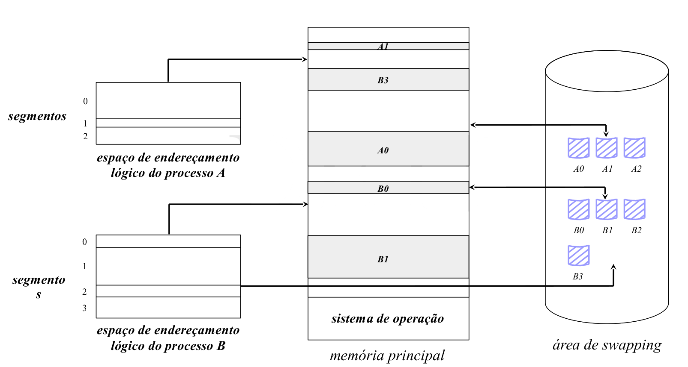

[^1]: ficheiro em código fonte de compilação separada

## Tipos de Segmentos:
- **região de código:** um segmento por cada módulo que contenha código (global ou local)
- **região de definição estática:** um segmento por cada módulo que contenha a definição de variáveis globais à aplicação ou módulo
- **zona de definição dinâmica local (heap):** um segmento
- **zona de definição dinâmica global:** um segmento por cada região de memória de partilha de dados
- **stack:** um segmento

## Tradução de um endereço lógico num endereço físico

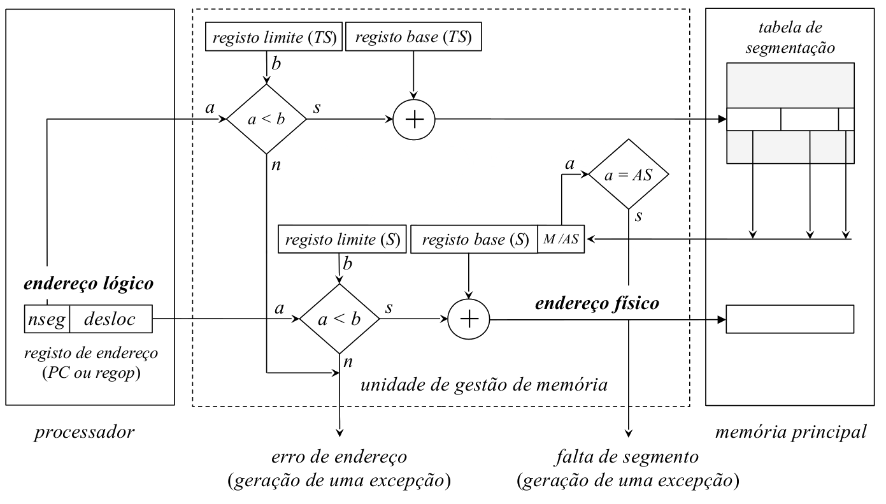

## Conclusão
A arquitectura segmentada, na sua versão pura, possui pouco interesse prático. Ao tratar a memória principal como um espaço contínuo, exige que sejam aplicadas técnicas de reserva de espaço para carregamento de um segmento de memória. 

Estas técnicas assemelham-se ao que acontece numa estrutura de memória real com partições variáveis

Como consequência, existe uma grande **desfragmentação externa da memória principal**, resultando no **desperdício de espaço**

Coloca-se outro problema referente a segmentos de dados de crescimento contínuo:

- pode ser necessário efetuar um acréscimo de espaço ao tamanho do segmento mas este poderá não ser realizado na sua localização presente
	- obriga à transferência total para outra região de endereçamento de memória
	- no caso limite não existe memória disponível para essa expansão
		- o processo é bloqueado/suspenso
		- o seu segmento ou a totalidade do espaço de endereçamento são movidos para a área de swapping

# Arquitectura Segmentada/Paginada
- Arquitectura mista que combina as características desejáveis das duas arquitecturas anteriores:
	- O **espaço de endereçamento lógico** é dividido em segmentos, com a atribuição na fa se de linkagem de múltiplos espaços de endereçamento autónomos
	- Cada um dos **segmentos** (espaços de endereçamento lineares) é divido em **páginas**
		- Origina um mecanismo de carregamento de blocos em memória principal com todas as características da arquitectura paginada


## Tradução de um endereço lógico num endereço físico numa arquitectura segmento-paginada


- O endereço lógico passa a possuir 3 campos:
	1. `nseg`: número do segmento
	2. `npah`: identifica a página no segmento
	3. `desloc`: localiza uma posição de memória concreta dentro da página (offset)
- A unidade de gestão de memória contém três registos base e um registo limite associados:
	- **endereço da tabela de segmentação** do processo: registo base (TS)
	- **número de entradas na tabela de segmentação**: registo limite
	- **endereço da tabela de paginação do segmento** que está a ser referenciado: registo base (TP)
	- **frame da memória principal** onde está localizada a página: registo base (P)
- Cada acesso à memória transforma-se em **3 acessos**:
	1. Referencio a **tabela de segmentação do processo** associada com o segmento descrito no campo `nseg` do endereço lógico para obter o **endereço da tabela de paginação do segmento**
	2. Referencio a entrada da **tabela de paginação do segmento** associada com a página  descrita no campo `npag` do endereço lógico para obter o `frame` da memória principal onde está localizada a página
	3. Referencio a posição de memória pretendida, concatenando o `nfrm` com o campo `desloc`


O campo `Perm` é deslocado para a entrada que descreve o segmento. O aceso pode ser tratado de maneira global, sendo as permissões aplicadas ao segmento.

Do ponto de vista do processo passam a ser precisas várias tabelas de paginação e várias tabelas de segmentação, sendo que cada tabela de segmentação pode ter mais que uma tabela de paginação.
 
## Vantagens vs Desvantagens

### Vantagens
- **geral:** pode ser aplicado independentemente do tipo de processos que vão ser executados. quer em número como em tamanho do seu espaço de endereçamento
- **grande aproveitamento da memória principal**: 
	- não conduz à fragmentação externa da memória
	- fragmentação interna +e desprezável
- **gestão mais eficiente da memória no que respeita a regiões de crescimento dinâmico**
- minimização do número de páginas que têm de estar residentes em memória principal em cada execução do processo

	 
### Desvantagens
- **Exige requisitos especiais de hardware**
	- Nem todos os processadores atuais de uso geral estão preparados para a sua implementação
- **Acesso à memória mais longo**
	- Cada acesso à memória é um **triplo acesso**
	- Pode ser minimizado se a unidade de gestão de memória contiver um **TLB** `translation lookaside buffer`
		- Seria usado para armazenamento das entradas da tabela de paginação recentemente referenciadas no segmento
- **Operacionalmente muito exigente**
	- A sua implementação por parte do SO é mais exigente do que a arquitectura paginada


# Políticas de Substituição de páginas em memória


Numa arquitectura paginada ou segmentada/paginada a memória principal é vista como dividida operacionalmente me frames do tamanho de cada página

- Cada `frame` vai permitir o armazenamento do conteúdo de uma página do espaço de endereçamento lógico de um processo
- As páginas podem estar em dois estados diferentes:
	- `locked`: **Não podems er removidas de memória**
		- páginas associadas com o _kernel_ do SO
		- _buffer cache_ do sistema de ficheiros
		- _memory mapped file_
		- _memory mapped variables_
		- _memory mapped IO_
	- `unlocked`: **podem ser removidas de memória**
		- páginas associadas aos processos convencionais

Os `frames` estão associados em listas biligadas:

- se ocupados e associados a páginas `unlocked` $\implies$ `frames` passíveis de substituição.
- `frames` livres

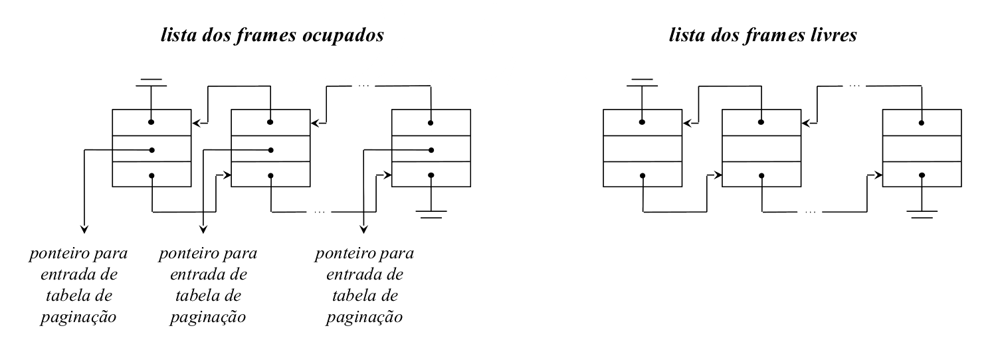

O tipo de memória implementado pela **lista dos frames** ocupados depende do **algoritmo de substituição utilizado**

Quando ocorre uma **falta de página** (programa tenta aceder a uma dada página que não está em memória):

- a situação mais provável é a lista dos `frames livres` estar vazia
	- torna-se necessário selecionar um `frame` para substituição da lista dos `frames ocupados`
	- alternativamente, pode manter-se sempre na `lista dos frames livres` alguns `frames`
		- usa-se um deles para carregar a página em falta
		- procede-se de seguida **substituição de um `frame ocupado`**
		- é o **método mais eficiente** (as operações decorrem em paralelo)

É necessário ir mudando dinamixamente as páginas dos vários processos que vão existindo em memória. Se assumirmos ainda que os processos em execução ocupam toda a memória disponível, se um dos processos que está em execução precisar de aceder a um bloco que ainda não está em memória, como faço?

O problema que se coloca é: **Que frame escolher para a substituição?**. Em teoria deve ser um `frame` que:

- não irá ser mais referenciado
- ou a sê-lo, sê-lo-á o mais tarde possível


A condição anterior enuncia o **Princípio da Otimalidade**. Ao aplicar estes critérios na escolha da página **Minimiza-se** a ocorrência de outras **faltas de página**

**PROBLEMA:** o princípio da otimalidade é **não-causal**. Não pode ser diretamente implementado.

**Objetivo:** Encontrar estratégias de substituição que sejam realizáveis e que ao mesmo tempo, se aproximem tanto quanto possível do princípio da otimalidade


## Algoritmo LRU - Least Recently Used
- Visa encontrar o `frame` que não é referenciado à mais tempo
- Assumo que cada processo vai usar às paginas que usou à menos tempo
- Partindo do **princípio da localidade de referência**, se um `frame` não é referenciado há muito tempo, é fortemente provável que não venha a ser referenciado num futuro próximo
- Cada referência à memória precisa de ser sinalizada com o instante da sua ocorrência (conteúdo de um `timer` ou um contador)
	- Preciso de ordenar cronologicamente quantas páginas possuo em memória
	- Como é pouco provável que a unidade de gestão de memória possua a capacidade de o fazer, será necessário _hardware_ especializado
	- Ou então tenho de ir à memória ler a lista em cada pedido de acesso à memória
- Sempre que ocorre uma **falta de página**, a **lista biligada** dos `frames` ocupados tem de ser percorrida para determinar qual o `frame` que foi acedido à mais tempo
	- HEAD: página acedida à menos tempo
		- tem de ser atualizada a cada acesso à memória
	- TAIL: página acedida à mais tempo

Possui um **custo de implementação elevado e pouco eficiente**

### Algoritmo NRU	- Not Recently used
- Aproximação menos exigente e relativamente eficiente do LRU.
- Usa os bits `Ref` e `Mod` que são processados tipicamente por uma unidade de gestão de memória convencional:
	- Sempre que uma página é acedida para leitura, o campo Ref é colocado a 1
	- Sempre que uma página é acedida para escrita, o campo Ref e Mod são colocados a 1
- Periodicamente o SO percorre a `lista dos frames ocupados` e coloca a **zero o bit `Ref`**
- Quando ocorre uma falta de página os `frames ocupados` enquadram-se numa das classes seguintes

		Classes		 Ref	    Mod
     ---------- --------- --------
 	  classe 0		 0			  0
 	  classe 1		 0			  1
 	  classe 2		 1			  0
 	  classe 3		 1			  1

A seleção da página a substituir será feita entre aquelas pertencentes à classe de ordem mais baixa existente atualmente na lista dos frames ocupados

## Algoritmo FIFO - First In, First Out
- Critério baseado no tempo de estadia das páginas em memória principal
- Baseia-se no pressuposto que **quanto mais tempo as páginas residirem em memória, menos provável será que elas sejam referenciadas a seguir**
- A `lista dos frames` ocupados está organizada num FIFO que espelha a **ordem de carregamento** das páginas correspondentes em memória principal

	 
Quando ocorre uma **falta de página:**

- retira-se do FIFO o elemento correspondente à **página há mais tempo em memória**


Algoritmo extremamente falível! Por exemplo:

- Páginas associadas com o código de um editor de texto
- compilador
- bibliotecas do sistema


## Algoritmo da Segunda Oportunidade
- A lista dos `frames ocupados` está organizada num FIFO que espelha a ordem de carregamento das páginas correspondentes em memória principal
- Quando ocorre uma **falta de página:**
	- retira-se do FIFO o **elemento correspondente à página há mais tempo em memória**
	- se o seu bit `Ref` estiver a **zero** $\implies$ a página é escolhida para **substituição**
	- caso contrário, coloca-se o seu bit `Ref` a **zero**
		- o nó é reintroduzido no fim da FIFO
		- o processo repete-se


## Algoritmo do relógio
- Segue a estratégia subjacente ao algoritmo da segunda oportunidade
- Torna a mais eficiente implementando a FIFO numa lista circular
- As operações `fifoIn` e `fifoOut` correspondem a incrementos de um ponteiro


Quando ocorre uma **falta de página:**

- Enquanto o bit `Ref` do `frame` pelo ponteiro **não for zero**:
	- O bit `Ref` é colocado a zero
	- O ponteiro avança uma posição
- A página apontada é escolhida para substituição
- O ponteiro avança uma posição

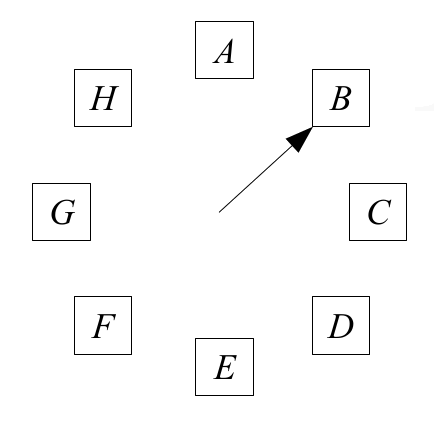

	
# Working set
- Quando um processo é colocado pela primeira vez na fila de espera dos processos `READY-TO-RUN`, só a 1ª  e última página do seu espaço de endereçamento (início do código e _stack_, respetivamente) é que são carregadas em memória
- Quando o processador for atribuído ao processo, suceder-se-ão inicialmente várias **faltas de página** a um ritmo rápido, porque não possui as páginas necessárias à sua execução em memória principal
- De seguida o número de flatas de página diminui e o processo entra numa fase da execução sem faltas de página
- Dado o princípio da localidade da referência, um processo vai aceder às mesmas variáveis e instruções.
- Assim, todas as páginas associadas à fração do espaço de endereçamento que o processo está atualmente a referenciar já estão todas presentes em memória principal

**working set:** conjunto de páginas é designado o working set do processo

Ao longo do tempo o `working set` do processo vai variar, não só no que respeita ao número, mas também às páginas concretas que o definem

Se o working set não consegue estar todo em memória vão ocorrer muitas **faltas de página** e o ritmo de execução será muito lento. Ocorre `trashning`:

- `frames` do working set a passarem para da memória para a swap 
- `frames` do `working set` na swap a serem passados para a memória

Se não correr `trashing`, o processo alterna entre períodos curtos que sofrerá muitas **faltas de páginas** e períodos longos quase sem **faltas de página**

O **objetivo prioritário** de qualquer política de substituição é garantir que mantem sempre o `working set` do processo em memória principal

Uma estratégia consiste em atribuir novos `frames`ao process sempre que este se encontre num período elevado de **faltas de página** e retirar-lhe `frames` quando as ocorrência de faltas de página baixar.


# Demand paging vs prepaging
Quando um processo é introduzido na fila de espera dos processos `READY-TO-RUN` pela 1ª  vez ou em resultado de uma suspensão, é preciso decidir que páginas colocar em memória principal.

- `Demand paging`: Estratégia  minimalista e menos eficiente
	- nenhuma página é colocada
	- o mecanismos de geração de **faltas de página** é que é responsável por formar o `working set` do processo
- `prepaging`: estratégia mais eficiente
	- procura-se adivinhar o `working set` do processo para minimizar a geração de faltas de página
	- na 1ª vez são colocadas as primeiras duas páginas atrás referidas
	- nas vezes seguintes, são colocadas o conjunto de páginas que residiam em memória no **momento em que o processo foi suspenso**

## Substituição global vs substituição local
Qual o âmbito da aplicação dos algoritmos de substituição? 

- **local**: a escolha é efetuada entre o conjunto de `frames` de um processo
- **global**: a escolha é efetuada entre o conjunto de todos os `frames` que continuem a lista de `frames` ocupados


É preferível o âmbito de aplicação global:

- Penso em cada processo globalmente
	- É mais fácil gerir `working sets` que mudam de dimensão
	- Permite-me suportar grandes variações de `working set` dos processos sem resultar desperdício de memória ou `trashing`
	- Desde que os processos não for em demasia, é possível minimizar o `thrashing`
		- Se a soma dos `working sets` de todos os processos é superior ao número de `frames unlocked` disponíveis em memória principal, entro em `thrashing`
		- A solução passa por ir suspendendo processos até que o `trashing` desapareça

