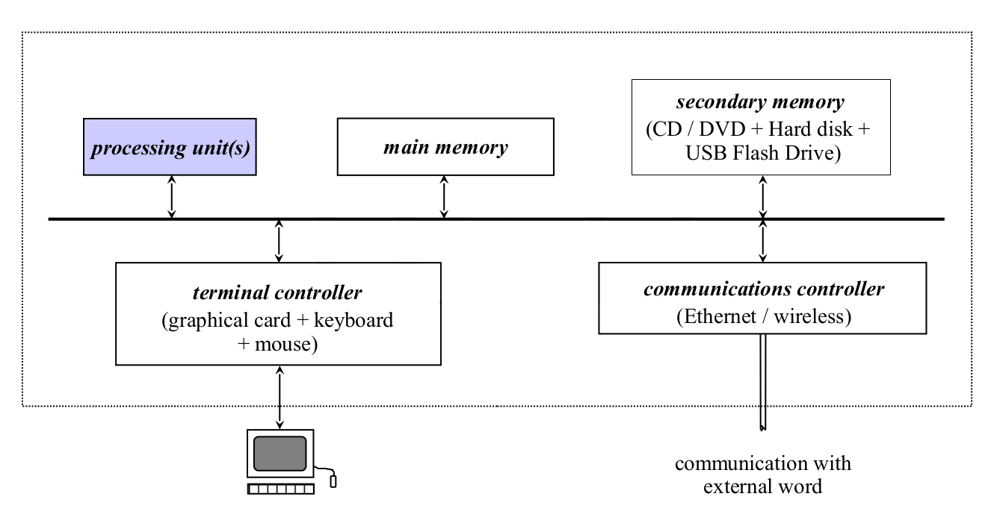
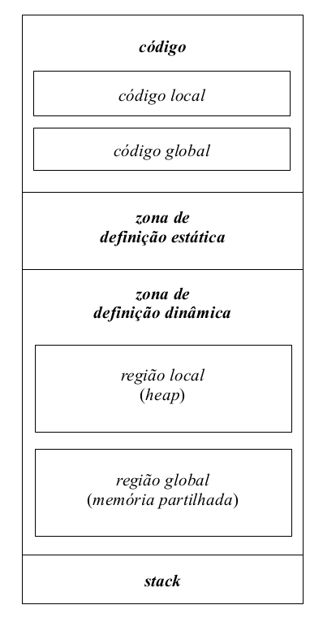

# Introdução à Gestão de Memória




## Porquê a gestão de memória
- Para puder executar um programa este tem de residir em **memória principal**
	- As varáveis, instruções, etc. tem de estar na memória principal, pelo menos de forma parcial
- É necessário maximizar a ocupação do processador e minimizar o tempo de resposta (`turn-around time`)
	- Ambiente **multiprogramado** 
	- Ocorre **comutação de processos**
	- Existem **vários processos em memória**
		

> **Lei de Parkinson** _"Os programas tendem a expandir-se ocupando toda a memória disponível"_

Ou seja, apesar de o espaço disponível em memória principal ter aumentado ao longo dos anos, os mesmos problemas mantêm-se.

Supondo que a **fração de ocupação do processador** pode ser modelada de forma simplificada pela expressão 
$$\%_{ocupação CPU} = 1 - p^n$$
onde:

- `p`: fração de tempo em que um processo está **bloqueado à espera** que as operações de I/O, sincronização, etc terminem
- `n`: **número de processos** que **coexistem** de forma concorrente e a competir por recursos em memória principal

Supondo $p = 0.8$, temos:

| Nº de processos em Memória Principal | \% de ocupação do Processador |
|:------------------------------------:|:-----------------------------:|
| 4  | 59 |
| 8  | 83 |
| 12 | 93 |
| 16 | 97 |

De forma mais geral:


O número de processos que devem estar em memória têm de ser otimizados. O número de processos em memória depende do número de processos I/O intensivos (`I/O-bound`) ou CPU intensivos (`CPU-bound`)

## Hierarquia da memória
Para melhorar a eficiência do sistema e reduzir os custos, as memórias devem ser otimizadas para as funções que vão desempenhar:

\begin{table}[H]
\centering
\begin{tabular}{@{}lccc@{}}
				& Cache        & Principal & Secundária \\ \toprule
 tamanho    & \begin{tabular}[c]{@{}c@{}}pequena \\ (dezenas de KB \\ ou unidades de MB)\end{tabular} 
 				& \begin{tabular}[c]{@{}c@{}}tamanho médio\\ (centenas de MB \\ ou unidades de MB)\end{tabular} 
				& \begin{tabular}[c]{@{}c@{}}Grande \\ (dezenas, centenas \\ ou milhares de GB)\end{tabular} \\
 velocidade & muito rápida & rápida    & lenta  \\
 preço      & cara  		   & razoável  & barata \\
 volátil    &  ✓           & ✓         & x \\ 
\end{tabular}
\vspace{5mm}
\caption{Comparação entre os diferentes tipos de memórias de um sistema computacional}
\end{table}


### Memória Cache
- Contém uma cópia das **posições** e **operandos** mais frequentemente referenciadas pelo processador num passador próximo
- Existem 3 tipos de `memória cache`
	- **L1:** localizada no **IC[^1] do processador**
	- **L2** e **L3:** localizadas num **IC autónomo** mas no mesmo substrato que L1
- O controlo da transferência de dados de/para a memória principal é feito de modo quase completamente **transparente** ao programador
- É útil devido ao **princípio da localidade de referência**


[^1]: IC: Integrated Circuit

### Memória Secundária
Duas funções principais:

- Armazenar de forma **não volátil** a informação (dados e programas), através de um **sistema de ficheiros** implementado no dispositivo
- **extender a memória principal** para que o tamanho desta não seja limitativo ao número de processos que podem coexistir em memória - `área de wapping`


### Princípio da Localidade da Referência

Temporal:
> Quando é acedido um endereço de memória (quer seja para r/w uma variável ou para ler uma instrução), a probabilidade de voltar a aceder a esse mesmo endereço de memória é mais elevada do que aceder a outros endereços de memória

Espacial:
> Quando é acedido um endereço de memória (quer seja +ara r/w de uma variável ou para ler uma instrução), a probabilidade de aceder a offsets do endereço de memória é mais elevada do que aceder a endereços muito distantes

Estes princípios baseiam-se no facto de que quanto **mais afastada** uma instrução/operando está do endereço atual que o processador está a executar, **menos vezes será referenciado**. 

O uso destes princípios no design de software e hardware tem como objetivo diminuir o tempo médio de acesso à referência.

Estes princípios foram derivados da **constatação heurística** do comportamento de um programa em execução. Conclui-se que as referências à memória durante a sua execução tendem a **concentrar-se** em **frações bem definidas do seu espaço de endereçamento** em intervalos de tempo mais ou menos longos

## Gestão da memória num ambiente multiprogramado
- **objetivo:** Tirar partido dos princípios anteriores


A função principal é **controlar a transferência de dados** entre a **memória principal** e a **memória secundária**, garantindo:

- Manter o _track_  das partes da **memória principal** que estão **ocupadas** e as partes que estão **livres**
- Reservar secções da memória para as necessidades dos processos
- Libertar secções da memória quando os processos terminam
- Transferir para a `área de swapping` a totalidade/parte do **espaço de endereçamento** de um processo quando a memória principal não consegue guardar todos os processos que coexistem em memória


## Espaço de Endereçamento


- Os ficheiros `object` (resultantes da compilação), possuem todos os seus endereços das diversas instruções, constantes e variáveis calculados a partir do endereço 0 (início dos endereços do módulo)


Se a linkagem for **estática:**

- Após linkagem, os diferentes ficheiros objeto são reunidos num único ficheiro executável
	- São resolvidas as várias referências externas
	- As bibliotecas de sistema podem não estar incluídas na linkagem para minimizar o tamanho do ficheiro
- O `loader` constrói a **imagem binária do espaço de endereçamento do processo**
	- ficheiro executável + bibliotecas de sistema
	- Resolve todas as dependências externas que não foram incluídas no ficheiro executável no processo de linkagem


Se a linkagem for **dinâmica**, cada referência no código do processo é substituída por um `stub`:

- `stub`: pequeno conjunto de instruções que determina a localização de uma rotina
	- se a rotina estiver em memória principal, executa-a
	- se não estiver, força o seu carregamento para memória principal (e depois executa-a)
- Quando um `stub` é executado **pela primeira vez** obtém a referência para o endereço de memória da rotina
	- Substitui no **código do processo** o seu endereço pelo endereço da rotina
	- Executa a rotina
- Quando a secção de código onde era executado o `stub` é novamente atingida, a **rotina do sistema** é executada **diretamente**


Como vários processos independentes podem executar a mesma biblioteca do sistema, ao todos executarem uma cópia do código **minimiza-se** a ocupação da **memória principal**




- As zonas de de código e definição estática de variáveis têm um **tamanho fixo**
	- Determinado pelo `loader`
- As `zonas de definição dinâmica` e a `stack` podem variar de tamanho ao longo da execução do programa
	- O espaço de memória referente à `zona de definição dinâmica` e à `stack` pode ser usada alternativamente entre eles
	- Quando o espaço para a `stack` cresce e o espaço disponível é esgotado pelo **lado da `stack`**, ocorre um `stack overflow`

### Exemplo
 Considerando o seguinte código fonte

```c
//ficheiro fonte
#include <stdio.h>
#include <stdlib.h>

int main (void)
{
	printf ("hello, world!\n");
	exit (EXIT_SUCCESS);
}
```

A produção do ficheiro objeto pode ser feita com:

```bash
gcc -Wall -c hello.c
```

E o executável gerado através de:

```bash
gcc -o hello hello.o
```

Antes da linkagem temos:

```bash
>> file hello.o
hello.o: ELF 32-bit LSB relocatable, Intel 80386, version 1 (SYSV), not stripped
```

```bash
>> objdump -fstr hello.o

hello.o:      file format elf32-i386
architecture: i386, flags 0x00000011:
HAS_RELOC, HAS_SYMS
start address 0x00000000
SYMBOL TABLE:
00000000 l     df *ABS* 00000000 hello.c
00000000 l     d .text            00000000
00000000 l     d .data            00000000
00000000 l     d .bss             00000000
00000000 l     d .rodata          00000000
00000000 l     d .note.GNU-stack 00000000
00000000 l     d .comment         00000000
00000000 g      F .text 0000002a main
00000000          *UND* 00000000 printf
00000000          *UND* 00000000 exit

RELOCATION RECORDS FOR [.text]:
OFFSET   TYPE              VALUE
00000014 R_386_32          .rodata
00000019 R_386_PC32        printf
00000026 R_386_PC32        exit

Contents of section .rodata:
 0000 68656c6c 6f20776f 726c6421 0a000000   hello world!....

Contents of section .comment:
 0000 00474343 3a202847 4e552920 332e332e   .GCC: (GNU) 3.3.
 0010 3120284d 616e6472 616b6520 4c696e75   1 (Mandrake Linu
 0020 7820392e 3220332e 332e312d 326d646b   x 9.2 3.3.1-2mdk
 0030 2900                                  ).
$
```

Após a linkagem temos:

```bash
>> file hello
hello: ELF 32-bit LSB executable, Intel 80386, version 1 (SYSV), for GNU/Linux
2.2.5, dynamically linked (uses shared libs), not stripped
```

```bash
>> objdump -fTR hello

hello:     file format elf32-i386
architecture: i386, flags 0x00000112:
EXEC_P, HAS_SYMS, D_PAGED
start address 0x080482d0
DYNAMIC SYMBOL TABLE:
0804829c      DF *UND* 000000e6 GLIBC_2.0      __libc_start_main
080482ac      DF *UND* 0000002d GLIBC_2.0      printf
080482bc      DF *UND* 000000c8 GLIBC_2.0      exit
080484b4 g    DO .rodata         00000004 Base         _IO_stdin_used
00000000 w    D *UND* 00000000                 __gmon_start__
DYNAMIC RELOCATION RECORDS
OFFSET   TYPE              VALUE
080495cc R_386_GLOB_DAT    __gmon_start__
080495c0 R_386_JUMP_SLOT   __libc_start_main
080495c4 R_386_JUMP_SLOT   printf
080495c8 R_386_JUMP_SLOT   exit
$
```

Podemos verificar que passam a existir mais instruções no ficheiro `object`:

- A função `main` tem de ser executada por alguém...
- É preciso construir o `argv` e o `argc` para passar à `main`
- Implica código adicional 

### Espaço de endereçamento lógico vs físico
- **espaço de endereçamento lógico:** espaço de endereçamento realocável
- **espaço de endereçamento físico:** região da memória principal onde o processo é carregado para ser executado


Uma vez que a **Imagem binária do espaço de endereçamento de um processo** é mapeada no **espaço lógico** do processo, em sistemas multiprogramados é necessário garantir:

- **mapeamento dinâmico:** capacidade de conversão em `run-time` de um **endereço lógico** num **endereço físico**
	- Passo intermédio para permitir o armazenamento do espaço de endereçamento de um processo em qualquer região da memória principal (incluindo a sua mudança em `run-time`)
- **proteção dinâmica:** impedimento em `run-time` de referenciar endereços que estão localizados fora do espaço de endereçamento do processo (aka, `core dumped`)


