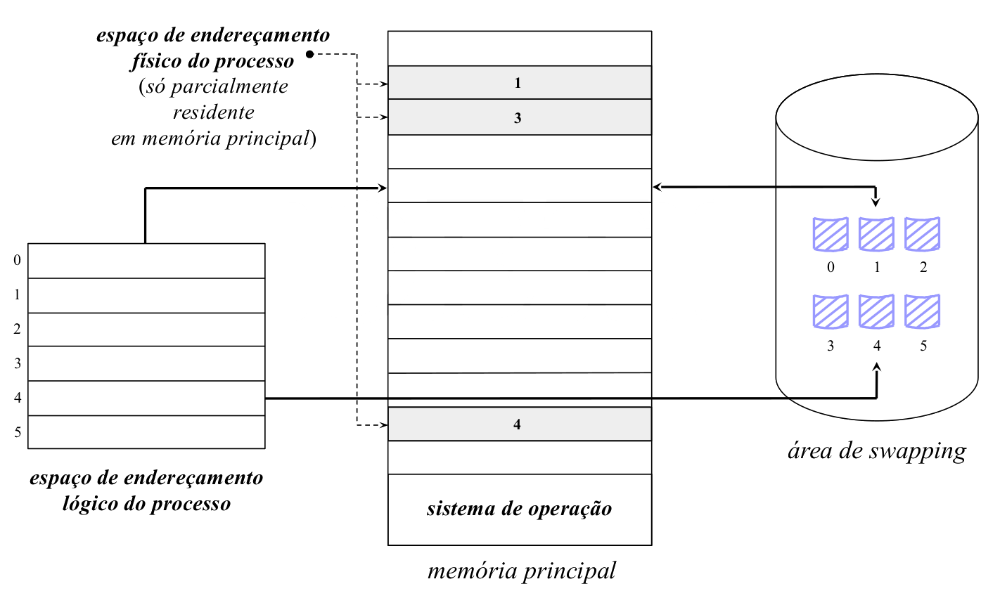

# Organização da memória virtual
- Num sistema com emmória virtual, o `espaço de endereçamento lógico` e o `espaço de endereçamento físico` de um processo estão **totalmente dissociados**

Como consequência:

- `O espaço de endereçamento de um processo não está limitado à memória física`
	- O espaço de endereçamento virtual é "ilimitado"
	- Podem criar-se mecanismos que permitam a um processo ocupar mais do que a memória principal disponível
- `Não continuidade do espaço de endereçamento físico`
	- O espaço de endereçamento dos processos podem estar dispersos por toda a memória
		- quer os blocos sejam de tamanho fixo ou variável
	- Garante-se uma ocupação mais eficiente do espaço disponível
- `Área de swapping`
	- Serve como extensão da memória principal
	- Guarda uma imagem atualizada dos espaços de endereçamento dos processos que coexistem de forma concorrente
	- guarda também as variáveis dinamicamente alocadas:
		- stack
		- zona de definição estática

Acesso à memória decomposto em 3 fases
- Camp ndk é comaprado com o registo limite do tD (tabela de blocos)
	- saber se o processo está ou não a aceder a um bloco válido
		- inválido: segmentation fault
- é trazido para hardware o registo base e o registo
- tem de ser verificado se o processo está em memória
	- transferit da swap para a memória
- Se há condições, é executado
- Se não condições
	- processp no extado blocked
		- ativada uma exceçãoq ue faz a transferir dos blocos de memória da swap para a memoria principal
- Sefor válido o endereço limite
	- é feita a soma com o registo base
- Qualquer acesso pode provocar dois acesso
	- Trazer para memória o bloco de memória do processo (Ir à memória buscar)
	- Aceder à memória
	- Tem de ser decomposto m 2 acessos

- Princípio da localidade da referência:
	- O MMU faz caching dos valores dos registos dos últimos 
- Tempo médio de acessso:
	- Acesso ao TLB + acesso à memória principal

- QUando o rpocesso inicia
	- Os escaloadores tentam sempre garantir que o registo PC e a stack estão em memória
		- São as condições principais para que um programa possa ser executado

## Falta de bloco
- Salvaguadar o contexto do processo
- Situações de falta de página degridem muito a qualidade do sistema

