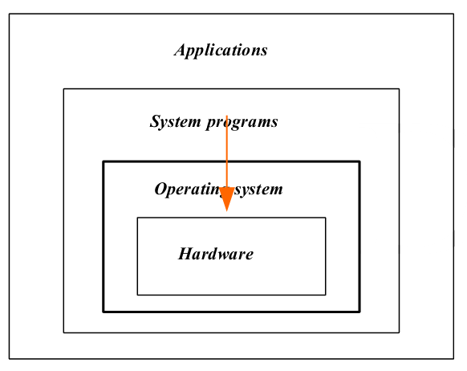

# Sistemas de Computação

## Vista simplificada de um sistema de computação
Um sistema operativo é um sistema/programa base que é executado pelo sistema computacional.

- Controla diretamente o `hardware`
- Providencia uma **camada de abstração** para que os restantes **programas** possam **interagir com o `hardware`** de forma indireta

Podem ser classificados em dois tipos:

1. **gráficos:** 
	- utilizam um contexto de **janelas** num ambiente gráfico
	- os elementos principais de interação são os **ícones** e os **menus**
	- a principal ferramente de `input` da interação humana é o rato
2. **textuais _(shell)_:**
	- baseado em comandos introduzidos através do teclado
	- uma linguagem de scripting/comandos[^1]

[^1]: Linguagem de programação baseada em comandos. Otimizada para a escrita de scripts e comandos mais complexos a partir de comandos mais simples

**Os dois tipos não são mutualmente exclusivas.**

- Windows: sistema operativo gráfico que pode lançar uma aplicação para ambiente textual
- Linux: sistema operativo textual que pode lançar ambiente gráfico

## Vista geral

Os sistemas de operação podem ser vistos segundo duas perspectivas:

1. `Extended Machines`
2. `Resource Manager`

### Extended Machine

O sistema operativo fornece **níveis de abstração** (APIs) para que os programas possam aceder a partes físicas do sistema,  criando uma **"máquina virtual":**

- Os programas e programadores têm uma visão virtual do computador, um **modelo funcional**
	- Liberta os programadores de serem obrigados a saber os detalhes do hardware
- Acesso a componentes do sistema mediado através de `system calls`
	- Executa o core da sua função em root (com permissões de super user)
	- Existem funções que só podem correr em super user
	- Todas as chamadas ao sistema são interrupções
	- Interface uniforme com o `hardware`
	- Permite as aplicações serem **portáteis** entre sistemas de computação **estruturalmente diferentes**
- O sistema operativo controla o **espaço de endereçamento fisico** criando uma camada de abstração **(memória virtual)**
		

#### Tipos de funções da extended machine
- Criar um ambiente interativo que sirva de interface máquina-utilizador
- Disponibilizar mecanismos para desenvolver, testar e validar programas
- Disponibilizar mecanismos que controlem e monitorizem a execução de programas, incluindo a sua intercomunicação e e sincronização
- Isolar os espaços de endereçamento de cada programa e geriri o espaço de cada um deles tendo em conta as limitações físicas da memória principal do sistema
- Organizar a memória secundária [^2] em sistema de ficheiros 
- Definir um modelo geral de acesso aos dispositivos de I/O, independentemente das suas características individuais
- Detetar situações de erros e estabelecer protocolos para lidar com essas situações

[^2]: Dispositivos de armazenamento não volátil: Disco rígidos
 
### Resource Manager

Sistema computacional composto por um conjunto de recursos:

- processador(es)
- memória
	- principal
	- secundária
- dispositivos de I/O e respetivos controladores

O sistema operativo é visto como um programa que gere todos estes recursos, efetuando uma gestão controlada e ordenada dos recursos pelos diferentes programas que tentam aceder a estes. O seu objetivo é **maximizar a performance** do sistema, tentando garantir a maior eficiência no uso dos recursos, que são **multiplexados no tempo e no espaço**.
 
## Evolução dos Sistemas Operativos
 
Primórdios : Sistema Electromecânco

- 1ª Geração: 1945 - 1955
	- Vacuum tubes
	- electromechanical relays
	-No operating system
	-programed in system
	- Program has fukk control of the machine
	- Cartões perfurada (ENIAC)
- 2ª geração: Transisteosres individuais

- 4ª Generação (1980 - presente)

	|Technology|Notes|
	|:----:|:-----:|
	| LSI/VLSI | Standard Operation systems (MS-DOS, Macintosh, Windows, Unix) |
	| personal computers (microcomputers) | Network operation systems |
	| network | |

- 5ª Generação (1990 - presente)

|Technology|Notes|
|:----:|:---:|
|Broadband, wireless | mobile operation systems (Symbian, iOS, Android)|
|system on chip|cloud computing|
|smartphone|ubiquitous computing|

