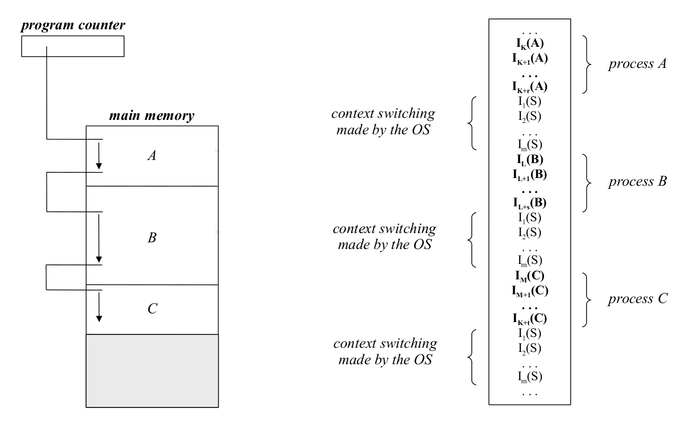
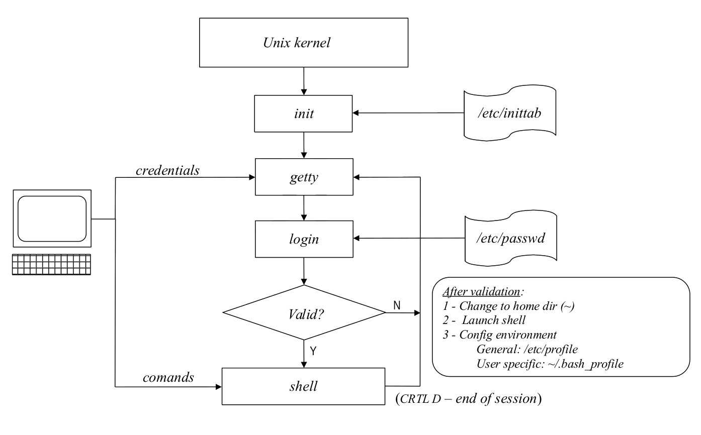
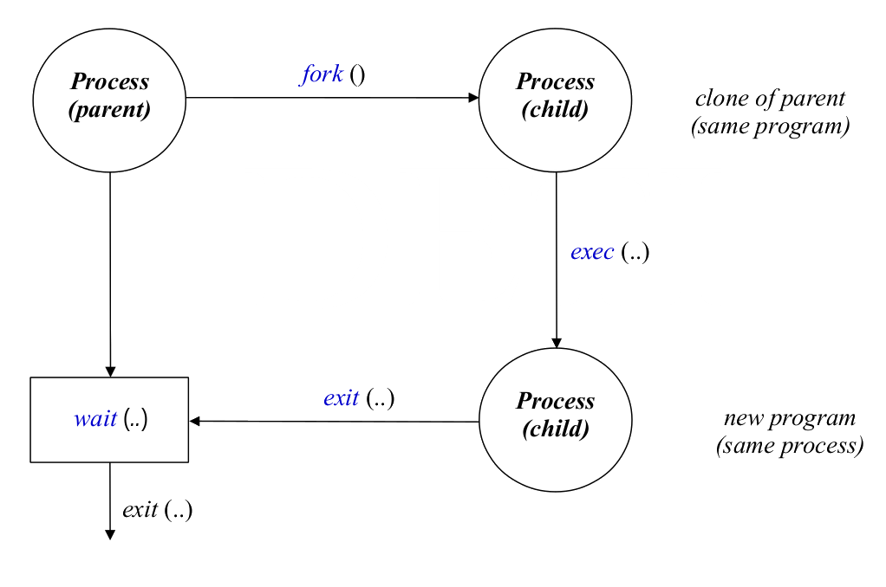
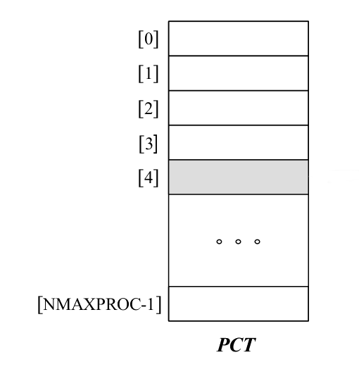
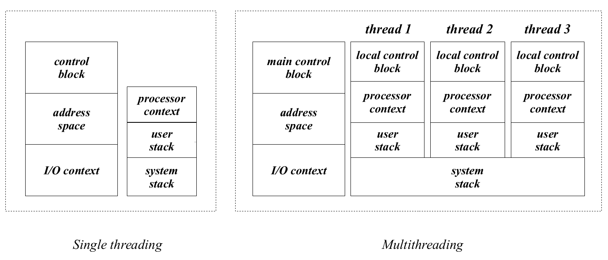
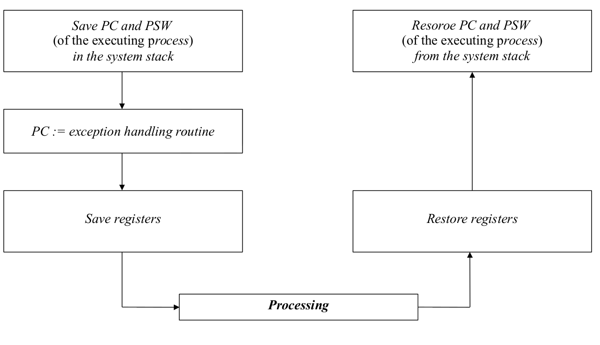
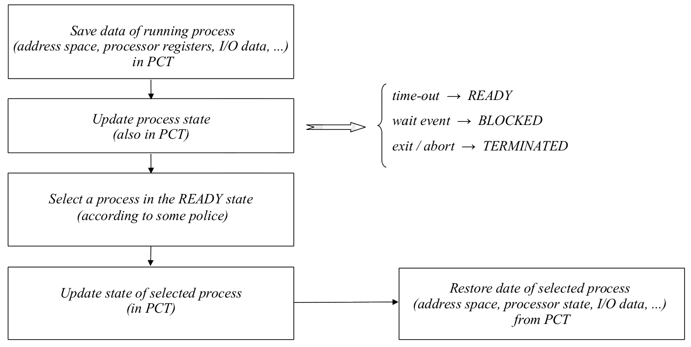
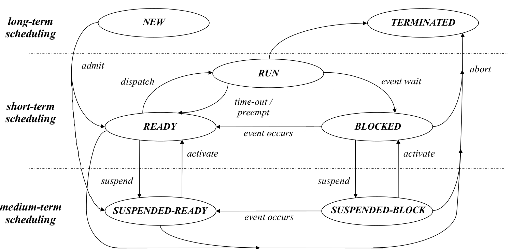

# Processes and Threads

## Arquitectura típica de um computador


## Programa vs Processo
- **programa**: conjunto de instruções que definem como uma tarefa é executada num computador
	- É apenas um **conjunto de instruções** (código máquina), nada mais
	- Para realizar essas **funções/instruções/tarefas** o código (ou a versão compilada dele) tem de ser executado(a)
- **processo:** Entidade que representa a **execução de um programa**
	- Representa a sua atividade
	- Tem associado a si:
		- código que ao contrário do programa está armazenado num endereço de memória (addressing space)
		- **dados** (valores das diferentes variáveis) da execução corrente
		- valores atuais dos registos internos do processador
		- dados dos I/Os, ou seja, dados que estão a ser transferidos entre dispositivos de input e output
		- Estado da execução do programa, ou seja, qual a próxima execução a ser executada (registo PC)
	- Podem existir diferentes processos do mesmo programa
		- Ambiente **multiprogramado** - mais processos que processadores
	 

## Execução num ambiente multiprogramado
O sistema assume que o processo que está na posse do processador irá **ser interrompido**, pudendo assim executar outro processo e dar a "sensação" em **macro tempo** de **simultaneidade**. Nestas situações, o OS é responsável por:

- tratar da **mudança do contexto de execução**, guardando
	- o valor dos registos internos
	- o valor das variáveis
	- o endereço da próxima instrução a ser executada
- chamar o novo processo que vai ocupar agora o CPU e:
	- Esperar que o novo processo termine a realização das suas operações **ou**
	- Interromper o processo,  **parando a sua execução no** processador quando este esgotar o seu `time quantum`
 



## Modelo de Processos	
Num ambiente **multiprogramado**, devido à constante **troca de processos**, é difícil expressar uma modelo para o processador. Devido ao elevado numero de processo e ao multiprogramming, torna-se difícil de saber qual o processo que está a ser executado e qual a fila de processos as ser executada.

É mais fácil assumir que o ambiente multiprogramado pode ser representado por um **conjunto de processadores virtuais**, estando um processo atribuído a cada um.

O processador virtual está:
	- **ON:** se o processo que lhe está atribuído está a ser executado
	- **OFF:** se o processo que lhe está atribuído não está a ser executado

Para este modelo temos ainda de assumir que:
- Só um dos processadores é que pode estar ativo num dado período de tempo
- O número de **processadores virtuais ativos é menor** (ou igual, se for um ambiente `single processor`) ao número de **processadores reais**
- A execução de um processo **não é afetada** pelo instante temporal nem a localização no código em que o processo é interrompido e é efetuado o switching
- Não existem restrições do número de vezes que qualquer processo pode ser interrompido, quer seja executado total ou parcialmente	

A operação de **switching entre processos** e consequentemente entre processadores virtuais ocorre de forma não **controlada** pelo programa a correr no CPU

Uma **operação de switching** é equivalente a efetuar o `Turning Off` de um processo virtual e o `Turning On` de outro processo virtual.

- `Turning Off` implica **guardar** todo o **contexto de execução**
- `Turning On` implica carregar todo o contexto de execução, **restaurando o estado do programa** quando foi interrompido


## Diagrama de Estados de um Processo
Durante a sua existência, um processo pode assumir diferentes estados, dependendo  das condições em que se encontra:

- **run:** O processo está em execução, tendo a posse do processador
- **blocked:** O processo está bloqueado à **espera de um evento externo** para estar em condições retomar a sua execução. Esse evento externo pode ser:
	- Acesso a um recurso da máquina
	- Fim de uma operação de I/O
	- ...
- **ready:** O processo está pronto a ser executado, mas está à espera que o processador lhe dê a ordem de `start/resume` para puder retomar a sua execução.

As **transições entre estados** normalmente resultam de **intervenções externas ao processo**, mas podem depender de situações em que o processo força uma transição:
	- termina a sua execução antes de terminar o seu `time quantum`
	- Leitura/Escrita em I/O (scanf/printf)

Mesmo que um processo **não abandone o processador por sua iniciativa**, o `scheduler` é responsável por **planear o uso do processador pelos diferentes processos**.

O `(Process) Scheduler` é um módulo do kernel que **monitoriza e gere as transições entre processos**. Assim, um `while(1)` não é executado _ad eternum_. Um processador `multiprocess` só permite que o ciclo infinito seja executado quando é atribuído `CPU time` ao processo.

Existem diferentes políticas que permitem controlar a execução destas transições


`Triggers` das transições entre estados:

- **dispatch:** 
	- O processo que estava em modo `run` perdeu o acesso ao processador.
	- Do conjunto de processos prontos a serem executados, tem de ser escolhido **um** para ser executado, sendo lhe atribuído o processador.
	- A escolha feita pelo `dispatcher` pode basear-se em:
		- um sistema de prioridades
		- requesitos temporais
		- aletoriedade
		- divisao igual do CPU
- **event wait:** 
	- O processo que estava a ser executado sai do estado `run`, não estando em execução no processador. 
		- Ou porque é impedido de continuar pelo scheduler
		- Ou por iniciativa do proprio processo.
			- _scanf_ 
			- _printf_ 
	- O CPU guarda o estado de execução do processo
	- O processo fica em estado `blocked` à **espera da ocorrência de um evento externo**, `event occurs`
- **event occurs:** 
	- Ocorreu o evento que o processo estava à espera
	- O processo transita do estado `blocked` para o estado `ready`, ficando em fila de espera para que lhe seja atribuído o processador
- **time_out:** 
	- O processo esgotou a sua janela temporal, `time quantum`
	- Atraves de uma interrupção em _hardware_, o sistema operativo vai forçar a saída do processo do processador
	- Transita para o estado _ready_ até lhe ser atribuído um novo `time-quantum` do CPU
	- A transição por time-out ocorre em qualquer momento do código. 
	- Os sistemas podem ter `time quantum` diferentes e os `time slots` alocados não têm de ser necessariamente iguais entre dois sistemas.
- **preempt**: 
	- O processo que possui a posse do processador tem uma prioridade mais baixa do que um processo que acordou e está pronto a correr (estado `ready`) 
	- O processo que está a correr no processador é **removido** e transita para o estado `ready`
	- Passa a ser **executado** o processo de **maior prioridade**

### Swap Area
O diagram de estados apresentado não leva em consideração que a **memória principal** (RAM) é **finita**. Isto implica que o número de **processos coexistents em memória é limitado**.

É necessário usar a **memória secundária** (Disco Rígido) para **extender a memória principal** e aumentar a capacidade de armazenamento dos estados dos processos.

A **memória `swap`** pode ser:

- uma partição de um disco
- um ficheiro

Qualquer processo que **não esteja a correr** por ser `swapped out`, libertando memória principal para outros processos

Qualquer processo `swapped out` pode ser `swapped in`, **quando existir memória principal disponível**

Ao diagrama de estados tem de ser adicionados:
- dois novos estados:
	- **suspended-ready:** Um processo no estado `ready` foi `swapped-out`
	- **suspended-blocked:** O processo no estado `blocked` foi `swapped-out`
- dois novos tipos de transições:
	- **suspend:** O processo é `swapped out`
	- **activate:** O processo é `swapped in`


### Temporalidade na vida dos processos
O diagrama assume que os processos são **intemporais**. Excluindo alguns processos de sistema, todos os processos são **temporais**, i.e.:

1. Nascem/São criados
2. Existem (por algum tempo)
3. Morrem/Terminam

Para introduzi a temporalidade no diagrama de estados, são necessários dois novos estados:
- **new:** 
	- O processo foi criado
	- Ainda não foi atribuido à `pool` de processos a serem executados
	- A estrutura de dados associado ao processo é inicializada
- **terminated:** 
	- O processo foi descartado da fila de processos executáveis
	- Antes de ser descartado, existem ações que tem de tomar _(needs clarification)_

Em consequência dos novos estados, passam a existir três novas transições:
	- **admit:** O processo é admitido pelo OS para a `pool` de processos executáveis
	- **exit:** O processo informa o SO que terminou a sua execução
	- **abort:** Um processo é forçado a terminar.
		- Ocorreu um `fatal error`
		- Um processo autorizado abortou a sua execução


## State Diagram of a Unix Process


As três diferenças entre o diagrama de estados de um processo e o diagrama de estados do sistema Unix são

1. Existem **dois estados run**
	1. **kernel running**
	2. **user running**
	- Diferem **no modo** como o processador **executa o código máquina**, existindo **mais instruções e diretivas disponíveis** no modo supervisor (`root`)
2. O estado **ready** é dividido em dois estados:
	1. **ready to run in memory:** O processo está pronto para ser executado/continuar a execução, estando guardado o seu estado em memória
	2. **preempted:** O processo que estava a ser executado foi **forçado a sair do processador** porque **existe um processo mais prioritário para ser executado**
	- Estes **estados são equivalentes** porque:
		- estão ambos **armazenado na memória principal**
		- quando um processo é `preempted` continua pronto a ser executado (não precisando de nenhuma informação de I/O)
		- Partilham a mesma fila (`queue`) de processos, logo são tratados de forma idêntica pelo OS
	- Quando um **processo do utilizador abandona o modo de supervisor** (corre com permissões `root`), **pode ser preempted**
3. A transição de `time-out` que existe no diagrama dos estados de um processo em UNIX é coberta pela transição `preempted`

## Supervisor preempting
Tradicionalmente, a **execução** de um processo **em modo supervisor** (`root`) implicava que a execução do processo **não pudesse ser** interrompida, ou seja, o processo não pudesser ser **`preempted`**. Ou seja, o UNIX não permitia **real-time processing**

Nas novas versões o código está dividido em **regiões atómicas**, onde a **execução não pode ser interrompida** para  garantir a **preservação de informação das estruturas de dados a manipular**. Fora das regiões atómicas é seguro interromper a execução do código

Cria-se assim uma nova transição, `return to kernel` entre os estados `preempted` e `kernel running`.

## Unix – traditional login


## Criação de Processos



```c
#include <stdio.h>
#include <stdlib.h>
#include <sys/types.h>
#include <unistd.h>

int main(void)
{
	printf("Before the fork:\n");
	printf(" PID = %d, PPID = %d.\n",
	getpid(), getppid());

	fork();

	printf("After the fork:\n");
	printf(" PID = %d, PPID = %d. Who am I?\n", getpid(), getppid());

	return EXIT_SUCCESS;
}
```

- **fork**: **clona** o processo existente, criando uma **réplica**
	- O estado de execução é igual, incluindo o PC _(Program Counter)_
	- O **mesmo programa** é executado em **processos diferentes**
	- Não existem garantias que o pai execute primeiro que o filho
		- Tudo depende do `time quantum` que o processo pai ocupa antes do `fork`
		- É um ambiente multiprogramado: os dois programas correm em **simultâneo no micro tempo**
- O **espaço de endereçamento** dos dois processos é **igual**
	- É seguida uma filosofia **copy-on-write**. Só é efetuada a cópia da página de memória se o **processo filho modificar** os conteúdos das variáveis 

		 
Existem variáveis diferentes: 

- **PPID:** Parent Process ID
- **PID:** Process ID


```c
#include <stdio.h>
#include <stdlib.h>
#include <sys/types.h>
#include <unistd.h>

int main(void)
{
	printf("Before the fork:\n");
	printf(" PID = %d, PPID = %d.\n",
	getpid(), getppid());

	int ret = fork();

	printf("After the fork:\n");
	printf(" PID = %d, PPID = %d, ret = %d\n", getpid(), getppid(), ret);

	return EXIT_SUCCESS;
}
```

O retorno da instrução `fork` é diferente entre o processo pai e filho:

- pai: `PID` do filho
- filho: `0`

O retorno do `fork` pode ser usado como variável booleana, de modo a **distinguir o código a correr no filho e no pai**


```c
#include <stdio.h>
#include <stdlib.h>
#include <sys/types.h>
#include <unistd.h>

int main(void)
{
	printf("Before the fork:\n");
	printf(" PID = %d, PPID = %d.\n", getpid(), getppid());

	int ret = fork();

	if (ret == 0)
	{
		printf("I'm the child:\n");
		printf(" PID = %d, PPID = %d\n", getpid(), getppid());
	}
	else
	{
		printf("I'm the parent:\n");
		printf(" PID = %d, PPID = %d\n", getpid(), getppid());
	}

	printf("After the fork:\n");
	printf(" PID = %d, PPID = %d, ret = %d\n", getpid(), getppid(), ret);

	return EXIT_SUCCESS;
}
```

O `fork` por si só não possui grande interesse. O interesse é puder executar um programa diferente no filho.

- **`exec` system call:** Executar um programa diferente no processo filho
- **`wait` system call:** O pai esperar pela conclusão do programa a correr nos filhos

 

```c
#include <stdio.h>
#include <stdlib.h>
#include <sys/types.h>
#include <unistd.h>

int main(void)
{
	/* check arguments */
	if (argc != 2)
	{
		fprintf(stderr, "spawn <path to file>\n");
		exit(EXIT_FAILURE);
	}
	char *aplic = argv[1];

	printf("===============================\n");

	/* clone phase */
	int pid;
	if ((pid = fork()) < 0)
	{
		perror("Fail cloning process");
		exit(EXIT_FAILURE);
	}

	/* exec and wait phases */
	if (pid != 0) // only runs in parent process
	{
		int status;
		while (wait(&status) == -1);
		printf("===============================\n");
		printf("Process %d (child of %d)”
		“ ends with status %d\n",
		pid, getpid(), WEXITSTATUS(status));
	}
	else // this only runs in the child process
	{
		execl(aplic, aplic, NULL);
		perror("Fail launching program");
		exit(EXIT_FAILURE);
	}
}
```

O `fork` pode **não ser bem sucedido**, ocorrendo um `fork failure`.


## Execução de um programa em C/C++


- Em C/C++ o nome de uma função é um ponteiro para a sua função.
- Em C/C++ um include não inclui a biblioteca
	- Indica ao programa que vou usar uma função que tem esta assinatura
- **atexit:** Regista uma função para ser chamada no fim da execução normal do programa
	- São chamadas em ordem inversa ao seu registo

## Argumentos passados pela linha de comandos e variáveis de ambiente
- **argv:** array de strings que representa um conjunto de parâmetros passados ao programa
	- **argv[0]** é a referência do programa
- **env** é um array de strings onde cada string representa uma variável do tipo: `name-value`
- **getenv** devolve o valor de uma variável definida no array **env**

## Espaço de Endereçamento de um Processo em Linux


- As variáveis que existem no processo pai também existem no processo filho (clonadas)
- As variáveis globais são comuns aos dois processos 
- Os endereços das variáveis são todos iguais porque o espaço de endereçamento é igual (memória virtual)
- Cada processo tem as suas variáveis, residindo numa página de memória física diferente
- Quando o processo é clonado, o espaço de dados só é clonado quando um processo escreve numa variável, ou seja, após a modificação é que são efetuadas as cópias dos dados

- O programa acede a um endereço de memória virtual e depois existe hardware que trata de alocar esse endereço de memória de virtual num endereço de memória física
- Posso ter dois processos com memmorias virtuais distintas mas fisicamente estarem ligados *ao mesmo endereço de memória*
- Quando faço um `fork` não posso assumir que existem variáveis partilhadas entre os processos 


### Process Control Table
É um array de `process control block`, uma estrutura de dados mantida pelo sistema operativo para guardar a informação relativa todos os processos.

O `process controlo block` é usado para guardar a informação relativa a apenas um processo, possuindo os campos:

- `identification`: id do processo, processo-pai, utilizador e grupo de utilizadores a que pertence
- `address space`: endereço de memória/swap onde se encontra:
	- código
	- dados
	- stack
- `processo state`: valor dos registos internos (incluindo o PC e o `stack pointer`) quando ocorre o switching entre processos
- `I/O context`: canais de comunicação e respetivos buffers que o processo tem associados a si
- `state`: estado de execução, prioridade e eventos
- `statistic`: _start time_, _CPU time_




# Threads
Num sistema operativo tradicional, um **processo** inclui:

- um **espaço de endereçamento**
- um **conjunto de canais de comunicação** com dispositivos de I/O
- uma única **`thread` de controlo** que:
	- incorpora os **registos do processador** (incluindo o PC)
	- **stack**

Existem duas stacks no sistema operativo:

- `user stack`: cada `processo`/`thread` possui a sua (em memória virtual e corre com privilégios do `user`)
- `system stack`: global a todo o sistema operativo (no `kernel`)

Podendo estes dois componentes serem **geridos de forma independente**.

Visto que uma `thread` é apenas um **componente de execução** dentro de um processo, várias `threads` **independentes** podem coexisitir no mesmo processo, **partilhando** o mesmo **espaço de endereçamento** e o mesmo contexto de **acesso aos dispositivos de I/O**. Isto é **`multithreading`**.

Na prática, as `threads` podem ser vistas como _light weight processes_



O controlo passa a ser centralizado na `thread` principal que gere o processo. A `user stack`, o **contexto de execução do processador** passa a ser dividido por todas as `threads`.

## Diagrama de Estados de uma thread


O diagrama de estados de um `thread` é  mais simplificado do que o de um processo, porque só são "necessários" os estados que interagem **diretamente com o processador**:

	- `run`
	- `ready`
	- `blocked`

Os estados `suspend-ready` e `suspended-blocked` estão relacionados com o **espaço de endereçamento** do **processo** e com a zona onde estes dados estão guardados, dizendo respeito ao **processo e não à thread**

Os estado `new` e `terminated`não estão presentes, porque a a gestão do ambiente multiprogramado prende-se com a restrição do número de `threads` que um processo pode ter, logo dizem respeito ao processo

## Vantagens de Multithreading

- **facilita a implementação** (em certas aplicações):
	- Existem aplicações em que **decompor a solução** num conjunto de `threads` que correm paralelamente facilita a implementação 
	- Como o `address space` e o `I/O context` são partilhados por todas as `threads`, `multithreading` favorece esta decomposição
- **melhor utilização dos recursos**
	- A criação, destruição e `switching` é mais eficiente usando `threads` em vez de processos
- **melhor performance**
	- Em aplicações `I/O driven`, `multithreading` permite que **várias atividades se sobreponham**, **aumentando a rapidez** da sua execução
- **`multiprocessing`**
	-  É possível **paralelismo em tempo real** se o processador possuir **múltiplos CPUs**


## Estrutura de um programa multithreaded
- Cada `thread` está tipicamente associada com a execução de uma função que implementa alguma atividade em específico
- A **comunicação entre `threads`** é efetuada através da estrutura de dados do **processo**, que é vista pelas `threads` como uma estrutura de dados global
- o **programa principal** também é uma `thread`
	- A 1ª  a ser criada
	- Por norma a última a ser destruída


## Implementação de Multithreading
**`user level threads:`**

- Implementadas por uma biblioteca
	- Suporta a criação e gestão das `threads` sem intervenção do `kernel`
- Correm com permissões do utilizador
- Solução versátil e portável
- Quando uma `thread` executa uma `system call` bloqueante, **todo o processo bloqueia** (o _kernel_ só "vê" o processo)
- Quando passo variáveis a `threads`, elas têm de ser estáticas ou dinâmicas

**`kernel level threads`**

- As `threads` são implementadas diretamente ao nível do kernel
- Menos versáteis e portáteis
- Quando uma `thread` executa uma `system call` bloqueante, **outra _thread_ pode entrar em execução**


### Libraria pthread


```c
#include <stdio.h>
#include <stdlib.h>
#include <pthread.h>

/* return status */
int status;

/* child thread */
void *threadChild (void *par)
{
	printf ("I'm the child thread!\n");
	status = EXIT_SUCCESS;
	pthread_exit (&status);
}

/* main thread */
int main (int argc, char *argv[])
{
	/* launching the child thread */
	pthread_t thr;
	if (pthread_create (&thr, NULL, threadChild, NULL) != 0)
	{
		perror ("Fail launching thread");
		return EXIT_FAILURE;
	}

	/* waits for child termination */
	if (pthread_join (thr, NULL) != 0)
	{
		perror ("Fail joining child");
		return EXIT_FAILURE;
	}
	
	printf ("Child ends; status %d.\n", status);
	return EXIT_SUCCESS;
}
```

## Threads em Linux
2 `system calls` para criar processos filhos:

- `fork`: 
	- cria uma novo processo que é uma **cópia integral** do processo atual
	- o `address space` é `I/O context` é duplicado
- `clone`:
	- cria um novo processo que pode partilhar elementos com o pai
	- Podem ser partilhados
		- espaço de endereçamento
		- tabela de `file descriptors`
		- tabela de `signal handlers`
	- O processo filho executa uma dada função
	
Do ponto de vista do `kernel`, `processos` e `threads` são **tratados de forma semelhante**

`Threads` do **mesmo processo** foma um `thread group` e possuem o **mesmo** `thread group identifier` (TGID). Este é o valor retornado pela função `getpid()` quando aplicada a um grupo de `threads`

As várias `threads` podem ser distinguidas dentro de um **grupo de `threads`** pelo seu `unique thread identifier` (TID). É o valor retornado pela função `gettid()`

```c
#include <stdio.h>
#include <stdlib.h>
#include <pthread.h>
#include <unistd.h>
#include <unistd.h>
#include <sys/types.h>

pid_t gettid()
{
	return syscall(SYS_gettid);
}

/* child thread */
int status;
void *threadChild (void *par)
{
	/* There is no glibc wrapper, so it was to be called 
	 * indirectly through a system call
	 */

	printf ("Child: PPID: %d, PID: %d, TID: %d\n", getppid(), getpid(), gettid());
	status = EXIT_SUCCESS;
	pthread_exit (&status);
}
```


O `TID` da _main thread_ é a mesma que o `PID` do processo, **porque são a mesma entidade**.
	
Para efetuar a compilação, tenho de indicar que a biblioteca pthread tem de ser usada na linkagem:

```bash
g++ -o x thread.cpp -pthread
```

# Process Switching

Revisitando a o diagrama de estados de um processador `multithreading`


Os processadores atuais possuem **dois modos de funcionamento:**

1. `supervisor mode`
	- Todas as intruções podem ser executadas
	- É um modo **priveligiado**, **reservado para o sistema operativo**
	- O modo em que o **sistema operativo devia funcionar**, para garantir que pode aceder a todas as funcionalidades do processador
	
2. `user mode`
	- Só uma **secção reduzida do instruction set** é que pode ser executada
	- Instruções de I/O e outras que modifiquem os registos de controlo não são executadas em `user mode`
	- É o **modo normal de operação**


A **troca entre os dois modos de operação**, `switching`, só é possível através de `exceções`. Uma `exceção` pode ser causada por:

- Interrupção de um dispositivo de I/O
- Instrução ilegal
	- divisão por zero
	- bus error
	- ...
- trap instruction (aka interrupção por _software_)


As **funções do `kernel`**, incluindo as `system calls` só podem ser lançadas por:

- **hardware** $\implies$ `interrupção`
- **traps** $\implies$ `intreeupção por software`


O ambiente de operação nestas condições é denominado de `exception handling`

## Exception Handling


A **troca do contexto de execução** é feita guardando o estado dos registos PC e PSW na stack do sistema, saltando para a rotina de interrupção e em seguida salvaguardando os registos que a rotina de tratamento da exceção vai precisar de modificar. No fim, os valores dos registos são restaurados e o programa resume a sua execução

## Processing a process switching


O algoritmo é bastante parecido com o tratamento de exceções:

1. Salvaguardar todos os dados relacioandos com o processo atual
2. Efetuar a troca para um novo processo
3. Correr esse novo processo
4. Restaurar os dados e a execução do processo anterior


# Processor Scheduling
A execução de um processo é uma sequência alternada de períodos de:

- `CPU burst`, causado pela execuçao de intruções do CPU 
- `I/O burst`, causados pela espera do resultado de pedidos a dispositivos de I/O


O processo pode então ser classificado como:

- `I/O bound` se possuir muitos e curtos `CPU bursts`
- `CPU bound` se possuir poucos e longos `CPU bursts`


O objetivo da **multiprogramação** é obter vantagem dos períodos de `I/O burst` para permitir outros processos terem acesso ao processador. A componente do sistema responsável por esta gestão é o `scheduler`.

A funcionalidade principal do `scheduler` é decidir da `poll` de processos prontos para serem executados que coexistem no sistema:

- quais é que devem ser executados?
- quando?
- por quanto tempo?
- porque ordem?


## Scheduler
Revisitando o diagrama de estados do processador, identificamos três `schedulers`



### Long-Term Scheduling
Determina que **programas são admitidos para serem processados**:

- Controla o **grau de multiprogramação** do sistema 
- Se um programa do utilizador ou `job` for aceite, torna-se um **processo** e é adicionado à **_queue_ de processos `ready` em fila de espera**
	- Em princípio é adicionado à `queue` do `short-term scheduler`
	- mas também é possível que seja adicionada à `queue` do `medium-term scheduler`
- Pode colocar processos em `suspended ready`, libertando quer a memória quer a fila de processos

### Medium Term Scheduling
Gere a `swapping area`

- As decisões de `swap-in` são **controladas pelo grau de multiprogramação**
- As decisões de `swap-in` são **condicionadas pela gestão de memória**


### Short-Term Scheduling
Decide qual o **próximo processo a executar**

- É invocado quando existe um evento que:
	- **bloqueia o processo atual**
	- **permite que este seja `preempted`**
- Eventos possíveis são:
	- interrupção de relógio
	- interrupção de I/O
	- `system calls`
	- signal (e.g. através de semáforos)

## Critérios de Scheduling 

### User oriented

**Turnaround Time:**

- Intervalo de de tempo entre a submissão de um processo até à sua conclusão
- Inclui:
	- Tempo de execução enquanto o processo tem a posse do CPU
	- Tempo dispendido à espera pelos recursos que precisa (inclui o processador)
- Deve ser minimizado em sistemas `batch`
- É a medida apropriada para um `batch job`


**Waiting Time:**

- Soma de todos os períodos de tempo em que o processo esteve à espera de ser colocado no estado `ready`
- Deve ser minimizado

**Response Time:**

- Intervalo de tempo que decorre desde a submissão de um pedido até a resposta começa a ser produzida
- Medida apropriada para sistemas/processos interativo
- Deve ser minimizada para este tipo de sistemas/processos
- O número de processos interativos deve ser máximizado desde que seja garantido um tempo de resposta aceitável


**Deadlines:**

- Tempo necessário para um processo terminar a sua execução
- Usado em sistemas de tempo real
- A percentagem de `deadlines` atingidas deve ser maximizada, mesmo que isso implique subordinar/reduzir a importância de outras objetivos/parâmetros do sistema

**Predictability:**

- Quantiza o impacto da carga (de processos) no tempo de resposta dos sistema
- Idealmente, um `job` deve correr no **mesmo intervalo de tempo** e gastar os **mesmos recursos de sistema** independentemente da carga que o sistema possui


### System oriented

**Fairness:**

- Igualdade de tratamento entre todos os processos
- Na ausência de diretivas que condicionem os processos a atender, deve ser efetuada um gestão e partilha justa dos recursos, onde todos os processos são tratados de forma equitativa
- Nenhum processo pode sofrer de `starvation`


**Throughput:**

- Medida do número de processos completados por unidade de tempo ("taxa de transferência" de processos)
- Mede a quantidade de trabalho a ser executada pelos processos
- Deve ser máximizado
- Depende do tamanho dos processos e da **política de escalonamento**


**Processor Utilization:**

- Mede a percentagem que o processador está ocupado
- Deve ser maximizada, especialmente em sistemas onde predomina a partilha do processador


**Enforcing Priorities:**

- Os processos de **maior prioridade** devem ser sempre favorecidos em detrimento de processos menos prioritários

\begin{center}
{\large É \textbf{impossível favorecer todos os critérios em simultâneo}}

Os \textbf{critérios a favorecer} dependem da \textbf{aplicação específica}
\end{center}


## Preemption & Non-Preemption

**Non-preemptive scheduling:**

- O processo mantêm o processador até este ser bloqueado ou terminar
- As **transições são sempre por `time-out`**
- Não existe `preempt`
- Típico de sistemas `batch`
	- Não existem deadlines nem limitações temporais restritas a cumprir

**Preemptive Scheduling:**

- O processo pode **perder o processador devido a eventos externos**
	- esgotou o seu `time-quantum`
	- um processo **mais prioritário** está `ready`
	- Tipico de **sistemas interativos**
		- É preciso garantir que a resposta ocorre em intervalos de tempo limitados
		- É preciso "simular" a ideia de paralelismo no `macro-tempo`
	- Sistemas em tempo real são `preemptive` porque existem `deadlines` **restritas** que precisam de ser cumpridas
	- Nestas situações é importante que um **evento externo** tenha capacidade de libertar o processador


## Scheduling

### Favouring Fearness


Todos os processos **são iguais** e são atendidos por **ordem de chegada**

- É implementado usando **FIFOs**
- Pode existir mais do que um processo à espera de eventos externos
- Existe uma fila de espera para cada evento
- Fácil de implementar
- Favorece processos `CPU-bound` em detrimento de processos `I/O-bound`
	- Só necessitam de acesso ao processador, não de recursos externos
	- Se for a vez de um processo `I/O-bound` ser atendido e não possuir os recursos de I/O que precisa tem de voltar para a fila
- Em **sistemas interativos**, o `time-quantum` deve ser escolhido cuidadosamente para obter um bom compromisso entre `fairness` e `response time`

Em função do scheduling pode ser definido como:

- `non-preemptive scheduling` $\implies$ `first come, first-served` (FCFS)
- `preemptive scheduling` $\implies$ `round robin`

### Priorities


Segue o princípio de que atribuir a mesma importância a todos os processos pode ser uma solução errada. Um sistema injusto _per se_ não é necessariamente mau.

- A **minimização do tempo de resposta** (`response time`) exigue que os processos `I/O-bound` sejam **priveligiados**
- Em **sistemas de tempo real**, os processos associados a **eventos/alarmes** e **ações do sistema operativo** sofrem de várias **limitações e exigências temporais**

	 
Para resolver este problema os processos são **agrupados** em grupos de **diferentes prioridades**

- Processos de maior prioridade são executados primeiros
- Processos de menor prioridade podem sofrer `starvation`

#### Prioridades Estáticas
As prio ridades a atribuir a cada processo são determinadas _a priori_ de forma **determinística**

- Os processos são **agrupados em classes de prioridade fixa**, de acordo com a sua importância relativa
- Existe risco de os processos menos prioritários sofrerem `starvation`
	- Mas se um **processo de baixa prioridade não é executado** é porque o sistema foi **mal dimensionado**
- É o sistema de `scheduling` mais injusto
- É usado em sistemas de tempo real, para garantir que os processos que são críticos são sempre executados


Alternativamente, pode se fazer:

1. Quando um processo é criado, é lhe **atribuído um dado nível de prioridade**
2. Em `time-out` a prioridade do processo é **decrementada**
3. Na ocorrência de um `wait event` a prioridade é **incrementada**
4. Quando o valor de **prioridade atinge um mínimo**, o valor da prioridade sofre um `reset`
	- É colocada no valor inicial, garantindo que o processo é executado
	
Previnem-se as situações de `starvation` impedindo que o processo não acaba por ficar com uma prioridade tão baixa que nunca mais consegue ganhar acesso

#### Prioridades Dinãmicas
- As classes de prioridades estão definidas de forma funcional _a priori_
- A mudança de um processo de classe é efetuada com base na utilização última janela de execução temporal que foi atribuída ao processo


Por exemplo:

- **Prioridade 1:** `terminais`
	- Um processo entra nesta categoria quando se efetua a transição `event occurs` (evento de escrita/leitura de um periférico) quando estava à espera de dados do `standard input device`
- **Prioridade 2:** `generic I/O`
	- Um processo entra nesta categoria quando efetua a transição `event occurs` se estava à espera de dados de **outro tipo de input device** que não o `stdin`
- **Prioridade 3:** `small time quantum`
	- Um processo entra nesta classe quando ocorre um `time-out`
- **Prioridade 4:** `large time quantum`
	- Um processo entra nesta classe após um sucessivo número de `time-outs`
 	- São claramente processos `CPU-bound` e o objetivo é atribuir-lhes janelas de execução com grande `time quantum`, mas menos vezes


##### Shortest job first (SJF) / Shortest process next (SPN)
Em sistemas `batch`, o `turnaround time` deve ser minimizado.

Se forem conhecidas **estimativas do tempo de execução** _a priori_, é possível estabelecer uma **ordem de execução** dos processos que **minimizam o tempo de `turnaround` médio** para um dado grupo de processos

Assumindo que temos N `jobs` e que o tempo de execução de cada um deles é $te_n$, com $n = 1, 2, ..., N$. O `average turnaround time` é:
$$t_m = te_1 + \frac{N-1}{N} \cdot te_2 + ... + \frac{1}{N} \cdot te_N$$

onde $t_m$ é o `turnaround time` mínimo se os `jobs` forem sorteados por ordem ascendente de tempo de execução (estimado)


Para **sistemas interativos**, podemos usar um sistema semelhante:

- Estimamos a taxa de ocupação da próxima janela de execução baseada na taxa de ocupação das janelas temporais passadas
- Atribuímos o processador ao processo cuja estimativa for a **mais baixa**


Considerando $fe_1$ como sendo a **estimativa da taxa de ocupação** da primeira janela temporal atribuída a um processo e $f_1$ a fração de tempo efetivamente ocupada:

- A estimativa da segunda fração de tempo necessária é 
  $$fe_2 = a \cdot fe_1 + (1-a) \cdot f_1$$
- A estimativa da e-nésima fração de tempo necessária é:
$$ fe_N = a \cdot fe_{N-1} + (1-a) \cdot f_{N-1}$$
  Ou alternativamente:
$$a^{N-1} \cdot fe_1 + a^{N-2} \cdot(1-a) \cdot fe_2 + a \cdot (1-a) \cdot fe_{N-2} + (1-a) \cdot fe_{N-1}$$ 


Com $a \in [0, 1]$, onde $a$ é um coeficiente que representa o peso que a história passada de execução do processo influencia a estimativa do presente

Esta alternativa levanta o problema que que processos `CPU-bound` podem sofrer de `starvation`. Este problema pode ser resolvido contabilizando o tempo que um processo está em espera (`aging`) enquanto está na fila de processos `ready`

Normalizando esse tempo em função do período de execução e denominando-o $R$, a **prioridade** de um processo pode ser dada por:
$$p = \frac{1+b \cdot R}{fe_N}$$
onde $b$ é o coeficiente que **controla o peso do aging** na fila de espera dos processos `ready`


## Scheduling Policies

### First Come, First Serve (FCFS)
Também conhecido como `First In First Out` (FIFO). O processo mais antigo na fila de espera dos processos `ready` é o primeiro a ser selecionado.

- `Non-preemptive` (em sentido estrito), podendo ser combinado com um esquema de prioridades baixo
- Favorece processos `CPU-bound` em detrimento de processos `I/O-bound`
- Pode resultar num **mau uso** do processador e dos dispositivos de I/O
- Pode ser utilizado com **low priority schemas**


Usando uma política de `first come first serve`, o resultado do scheduling do processador é:


- O P1 começa a usar o CPU. 
- Como é um sistema FCFS, o processo 1 só larga o CPU passado 3 ciclos. 
- O processo P2 é o processo seguinte na fila `ready`, e ocupa o CPU durante 10 ciclos.
- Quando P2 termina, P1 é o processo que está à mais tempo à espera, sendo ele que é executado
- Quando P2 abandona voluntariamente o CPU, o processo P1 corre os seus primeiros dois ciclos
- Quando P3 liberta o CPU, o processo P1 termina os últimos 3 ciclos que precisa
- Quando P3 liberta o CPU, o processo P1 como é `I/O-bound` e precisa de 5 ciclos para o dispositivo estar pronto fica mais dois ciclos à espera para puder terminar executando o seu último ciclo

### Round-Robin
- `Preemptive`
	- O `scheduler` efetua a gestão baseado num `clock`
	- A cada processo é atribuído um `time-quantum` máximo antes de ser `preempted`
- O processo **mais antigo** em `ready` é o **primeiro a ser selecionado** 
	- não são consideradas prioridades
- Efetivo em sistemas `time sharing` com objetivos globais e sistemas que processem transações
- **Favorece** `CPU-bound` em detrimento de processos `I/O-bound`
- Pode resultar num **mau uso de dispositivos I/O**


Na escolha/otimização do `time quantum` existe um **tradeoff:**

- **tempos muito curtos** favorecem a execução de **processos pequenos**
	- estes processos vão ser executados **rapidamente**
- **tempos muito curtos** obrigam a `processing overheads` devido ao `process switching` **intensivo**

Para os processos apresentados acima, o diagrama temporal de utilização do processador, para um `time-quantum` de 3 ciclos é:


A história de processos em `ready` em fila de espera é: 2, 1, 3, 2, 1, 2, 3, 1


### Shortest Process Next (SPN) ou Shortest Job First (SJF)
- `Non-preemptive`
- O process com o `shortest CPU burst time` (menor tempo espectável de utilização do CPU) é o **próximo a ser selecionado**
	- Se vários processos tem o **mesmo tempo de execução** é usado FCFS para desempatar
- Existe um **risco de `starvation`** para grandes processos
	- o seu acesso ao CPU pode ser **sucessivamente adiado** se existir "forem existindo" processos com **tempo de execução menor**
- Normalmente é usado em escalonamento de logo prazo, `long-term scheduling` em sistemas `batch`, porque os utilizadores esperam estimar com precisão o tempo máximo que o processo necessita para ser executado


### Linux

No Linux existem 3 classes de prioridades:


1. **FIFO**, `SCHED_FIFO`
	- `real-time threads`, com politíca de prioridades
	- uma `thread` em execução é `preempted` apenas se um processo de **mais alta prioridade da mesma classe** transita para o estado `ready`
	- uma `thread` em execução pode **voluntariamente abandonar o processador**, executando a primitiva `sched_yeld`
	- dentro da mesma classe de prioridade a política escolhida é `First Come, First Serve` (FCFS)
	- Só o `root` é que pode lançar processos em modo FIFO
2. **Round-Robin real time threads**,  `SCHED_RR`
	- `threads` com prioridades com necessidades de execução em tempo real
	- Processos nesta classe de prioridades são `preempted` se o seu `time-quantum` termina
3. **Non real time threads**, `SCHED_OTHER`
	- Só são executadas se não existir nenhuma `thread` com necessidades de execução em tempo real
	- Está associada à processos do utilizador
	- A política de escalonamento tem mudado à medida que a são lançadas novas versões do _kernel_


A **escala de prioridades** varia

- 0 a 99 para `real-time threads`
- 100 a 139 para as restantes

Para lançar uma `thread` (sem necessidades de execução em tempo real) com diferentes prioridades, pode ser usado comando `nice`.

Por _default_, o comando lança uma `thread` com prioridade 120. O comando aceita um `offset` de [-20, +19] para obter a prioridade mínima ou máxima.

#### Algoritmo Tradicional
- Na classe `SCHED_OTHER` as prioridades são baseadas em **créditos**
- Os créditos do processo em execução são **decrementados** à medida que ocorre uma interrupção do `real time clock`
- O processo é `preempted` quando são atingidos zero créditos
- Quando todos os processos `ready` têm zero créditos, os créditos de **todos os processos** (incluindo os que estão bloqueados) são **recalculados** segundo a fórmula:
	$$CPU_j(i) = \frac{CPU_j(i-1)}{2} + PBase_j + nice_j$$
onde são tido em conta a **história passada de execução do processo** e as **prioridades**
- O `response time` de processos `I/O-bound` é minimizado
- A `starvation` de processos `CPU-bound` é evitada
- Solução **não adequada para múltiplos processadores** e é má se o número de processos é elevado


## Novo Algoritmo
- Os processos na classe `SCHED_OTHER` passam a usar um `completely fair scheduler (CFS)`
- O scheduling é baseado no `vruntime`, _virtual run time_, que mede durante quanto tempo uma `thread` esteve em execução
	- o `virtual run time` está relacionado quer com o **tempo de execução real** (`physical run time`) e a **prioridade** da `thread`
	- Quanto maior a prioridade de um processo, menor o `physical run time`
- O `scheduler` seleciona as `threads` com menor `virtual run time`
	- Uma `thread` com prioridade mais elevada que fique pronta a ser executada pode "forçar" um `preempt` uma `thread` com menor prioridade
		- Assim é possível que uma `thread I/O bound` "forçar" o processador a `preempt` um processo `CPU-bound`
- O algoritmo é implementado com base numa `red-black tree` do processador


