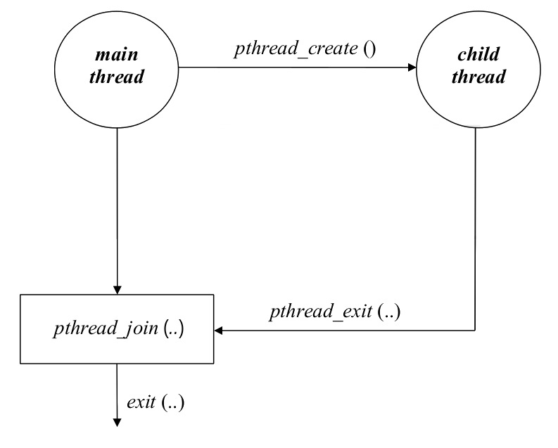

# Threads
Num sistema operativo tradicional, um **processo** inclui:

- um **espaço de endereçamento**
- um **conjunto de canais de comunicação** com dispositivos de I/O
- uma única **`thread` de controlo** que:
	- incorpora os **registos do processador** (incluindo o PC)
	- **stack**

Existem duas stacks no sistema operativo:

- `user stack`: cada `processo`/`thread` possui a sua (em memória virtual e corre com privilégios do `user`)
- `system stack`: global a todo o sistema operativo (no `kernel`)

Podendo estes dois componentes serem **geridos de forma independente**.

Visto que uma `thread` é apenas um **componente de execução** dentro de um processo, várias `threads` **independentes** podem coexisitir no mesmo processo, **partilhando** o mesmo **espaço de endereçamento** e o mesmo contexto de **acesso aos dispositivos de I/O**. Isto é **`multithreading`**.

Na prática, as `threads` podem ser vistas como _light weight processes_


O controlo passa a ser centralizado na `thread` principal que gere o processo. A `user stack`, o **contexto de execução do processador** passa a ser dividido por todas as `threads`.

## Diagrama de Estados de uma thread


O diagrama de estados de um `thread` é  mais simplificado do que o de um processo, porque só são "necessários" os estados que interagem **diretamente com o processador**:

	- `run`
	- `ready`
	- `blocked`

Os estados `suspend-ready` e `suspended-blocked` estão relacionados com o **espaço de endereçamento** do **processo** e com a zona onde estes dados estão guardados, dizendo respeito ao **processo e não à thread**

Os estado `new` e `terminated`não estão presentes, porque a a gestão do ambiente multiprogramado prende-se com a restrição do número de `threads` que um processo pode ter, logo dizem respeito ao processo

## Vantagens de Multithreading

- **facilita a implementação** (em certas aplicações):
	- Existem aplicações em que **decompor a solução** num conjunto de `threads` que correm paralelamente facilita a implementação 
	- Como o `address space` e o `I/O context` são partilhados por todas as `threads`, `multithreading` favorece esta decomposição
- **melhor utilização dos recursos**
	- A criação, destruição e `switching` é mais eficiente usando `threads` em vez de processos
- **melhor performance**
	- Em aplicações `I/O driven`, `multithreading` permite que **várias atividades se sobreponham**, **aumentando a rapidez** da sua execução
- **`multiprocessing`**
	-  É possível **paralelismo em tempo real** se o processador possuir **múltiplos CPUs**


## Estrutura de um programa multithreaded
- Cada `thread` está tipicamente associada com a execução de uma função que implementa alguma atividade em específico
- A **comunicação entre `threads`** é efetuada através da estrutura de dados do **processo**, que é vista pelas `threads` como uma estrutura de dados global
- o **programa principal** também é uma `thread`
	- A 1ª  a ser criada
	- Por norma a última a ser destruída


## Implementação de Multithreading
**`user level threads:`**

- Implementadas por uma biblioteca
	- Suporta a criação e gestão das `threads` sem intervenção do `kernel`
- Correm com permissões do utilizador
- Solução versátil e portável
- Quando uma `thread` executa uma `system call` bloqueante, **todo o processo bloqueia** (o _kernel_ só "vê" o processo)
- Quando passo variáveis a `threads`, elas têm de ser estáticas ou dinâmicas

**`kernel level threads`**

- As `threads` são implementadas diretamente ao nível do kernel
- Menos versáteis e portáteis
- Quando uma `thread` executa uma `system call` bloqueante, **outra _thread_ pode entrar em execução**


### Libraria pthread



```c
#include <stdio.h>
#include <stdlib.h>
#include <pthread.h>

/* return status */
int status;

/* child thread */
void *threadChild (void *par)
{
	printf ("I'm the child thread!\n");
	status = EXIT_SUCCESS;
	pthread_exit (&status);
}

/* main thread */
int main (int argc, char *argv[])
{
	/* launching the child thread */
	pthread_t thr;
	if (pthread_create (&thr, NULL, threadChild, NULL) != 0)
	{
		perror ("Fail launching thread");
		return EXIT_FAILURE;
	}

	/* waits for child termination */
	if (pthread_join (thr, NULL) != 0)
	{
		perror ("Fail joining child");
		return EXIT_FAILURE;
	}
	
	printf ("Child ends; status %d.\n", status);
	return EXIT_SUCCESS;
}
```

## Threads em Linux
2 `system calls` para criar processos filhos:

- `fork`: 
	- cria uma novo processo que é uma **cópia integral** do processo atual
	- o `address space` é `I/O context` é duplicado
- `clone`:
	- cria um novo processo que pode partilhar elementos com o pai
	- Podem ser partilhados
		- espaço de endereçamento
		- tabela de `file descriptors`
		- tabela de `signal handlers`
	- O processo filho executa uma dada função
	
Do ponto de vista do `kernel`, `processos` e `threads` são **tratados de forma semelhante**

`Threads` do **mesmo processo** foma um `thread group` e possuem o **mesmo** `thread group identifier` (TGID). Este é o valor retornado pela função `getpid()` quando aplicada a um grupo de `threads`

As várias `threads` podem ser distinguidas dentro de um **grupo de `threads`** pelo seu `unique thread identifier` (TID). É o valor retornado pela função `gettid()`

```c
#include <stdio.h>
#include <stdlib.h>
#include <pthread.h>
#include <unistd.h>
#include <unistd.h>
#include <sys/types.h>

pid_t gettid()
{
	return syscall(SYS_gettid);
}

/* child thread */
int status;
void *threadChild (void *par)
{
	/* There is no glibc wrapper, so it was to be called 
	 * indirectly through a system call
	 */

	printf ("Child: PPID: %d, PID: %d, TID: %d\n", getppid(), getpid(), gettid());
	status = EXIT_SUCCESS;
	pthread_exit (&status);
}
```


O `TID` da _main thread_ é a mesma que o `PID` do processo, **porque são a mesma entidade**.
	
Para efetuar a compilação, tenho de indicar que a biblioteca pthread tem de ser usada na linkagem:

```bash
g++ -o x thread.cpp -pthread
```

